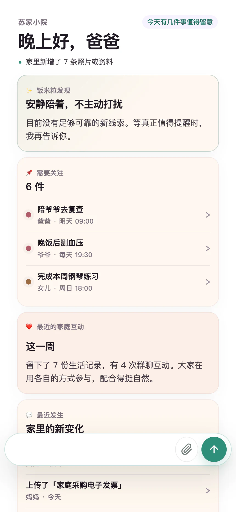
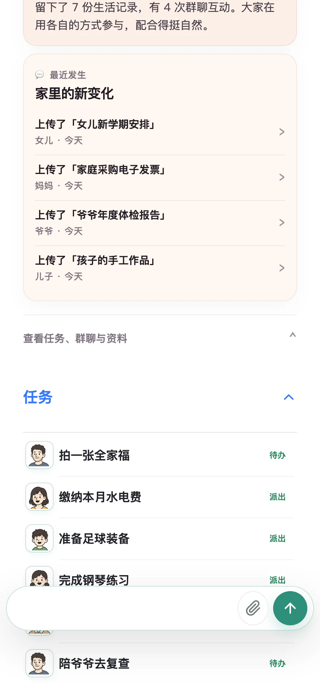
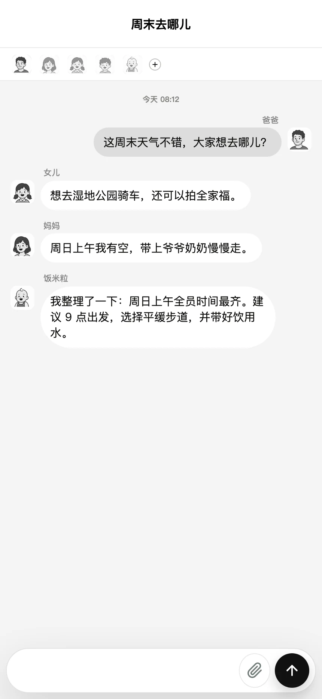

<p align="center">
  
</p>

<h1 align="center">Fanmili</h1>

<p align="center">
  <strong>Your private family OS</strong><br />
  A self-hosted, AI-powered family hub for chats, tasks, photos, documents, and shared knowledge.
</p>

<p align="center">
  
  
  
  
  
</p>

<p align="center">
  <a href="https://fanmili.superjunior.online"><strong>🚀 Try the Live Demo</strong></a>
</p>

<p align="center">
  
</p>

Keep your family's memories, tasks, conversations, photos, and knowledge in one private place.

## Live Demo

Open **[fanmili.superjunior.online](https://fanmili.superjunior.online)** and sign in with the public sandbox account:

```text
Phone:    13800000002
Password: FanmiliDemo2026!
```

No registration is required. On a fresh browser, the demo account opens a three-step setup tour before entering the family home.

The sandbox contains synthetic family data. You can create tasks, conversations, and records directly from the home screen. Do not upload personal or sensitive information to the public demo.

## Why Fanmili?

Family information is everywhere:

- 💬 Messages are buried in chat apps
- 📷 Photos are scattered across devices
- 📝 Important tasks are easily forgotten
- 📄 Documents are difficult to organize
- 🧠 Family knowledge disappears over time

Fanmili brings everything together:

```text
Family Chat
     +
Personal Tasks
     +
Photos & Documents
     +
AI-assisted Memory
        ↓
Your Private Family OS
```

## Features

### 🏠 Family Dashboard

A calm overview of your family's daily life:

- Family members and recent activity
- Important reminders and personal tasks
- Shared information and family updates
- One-handed swipe navigation for mobile use

### ✅ Personal and Family Tasks

Keep track of the things that matter:

- Medical appointments
- Household responsibilities
- School and travel plans
- Important deadlines and recurring reminders

### 📚 Family Knowledge Base

Preserve useful family information with clear ownership:

- Photos and family memories
- PDF files, reports, and receipts
- Notes, records, and shared documents
- Source-aware summaries for uploaded materials

### 🤖 AI Family Assistant

Connect a model API and let AI help organize family information.

Examples:

- "When is grandma's next appointment?"
- "Summarize our travel plans."
- "Create a shopping list from our conversation."
- "What should we remember from this document?"

AI suggestions remain reviewable. Actions such as saving memories or creating tasks require family confirmation.

### 🔒 Privacy First

Your family data belongs to you:

- Self-hosted on your computer or NAS
- Local SQLite database and file storage
- No mandatory cloud account
- No data selling
- Back up one persistent data volume

## Screenshots

<p align="center">
  
  
</p>

<p align="center">
  
  
</p>

<p align="center">
  
</p>

## Quick Start

### Docker Compose

```bash
git clone https://github.com/sujianleo/Fanmili.git
cd Fanmili
docker compose up -d
```

Open:

```text
http://localhost:3000
```

Create the first family administrator when prompted. Accounts, SQLite data, uploaded files, and generated security keys are stored in the persistent `family-data` volume.

## Enable Family AI

> [!IMPORTANT]
> Accounts, tasks, conversations, photos, and document storage work without an AI provider. Natural-language understanding, AI suggestions, memory assistance, and document insights require a model API.

Fanmili currently prioritizes the **DeepSeek API**. Add your API key during onboarding or under **Settings → AI**, then use **Test API** to verify it with a real request.

You can also configure it through an environment file:

```dotenv
DEEPSEEK_API_KEY=your_deepseek_api_key
```

```bash
docker compose up -d
```

The key is encrypted and stored in your own Fanmili data volume when configured through the app.

## Tech Stack

- Next.js
- TypeScript
- SQLite
- Docker
- PWA
- LangChain / LangGraph

## Roadmap

Fanmili will grow from a reliable family workspace into a private, auditable family AI OS.

<p align="center">
  
</p>

See [ROADMAP.md](ROADMAP.md) for detailed milestones and completion criteria.

## Contributing

Fanmili is an open-source project. Ideas, feedback, bug reports, and contributions are welcome.

Open an issue or start a discussion to share a real family use case.

## Support Fanmili

If Fanmili helps you build a calmer, better-organized family life, consider giving the project a ⭐.

It helps more families and contributors discover the project.

## License

[MIT](LICENSE)

Resource icons are provided by [Microsoft Fluent Emoji](https://github.com/microsoft/fluentui-emoji) under the MIT License.
