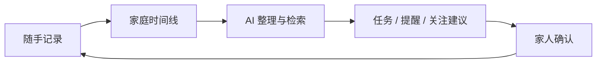
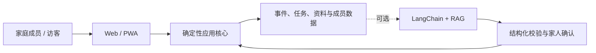

<p align="center">
  
</p>

<h1 align="center">我爱饭米粒</h1>

<p align="center">
  <strong>用心记录 守护家庭</strong><br />
  <sub>把散落在聊天、相册和脑子里的家事，慢慢整理成一家人都能接得住的时间线。</sub>
</p>

<p align="center">
  
  
  
  
</p>

<p align="center">
  <a href="#why">它有什么不一样</a> ·
  <a href="#scenes">能帮家里做什么</a> ·
  <a href="#ai">AI 怎么用</a> ·
  <a href="#start">开始使用</a> ·
  <a href="docs/user-guide.md">使用手册</a> ·
  <a href="docs/system-architecture.md">架构文档</a>
</p>

---

<a id="why"></a>

## 家里不缺一个新群，缺的是有人把事情记住

饭米粒**不是微信，也不是对话机器人，更不是 OS 级系统**。

它有群聊，但不准备和微信争夺“早上好”表情包；它也有 AI，但不是问一句答一句、聊完双双失忆。它更想干那些不起眼、却总得有人操心的长线活：

- 今天随手记下一件事，半年后还能找到来龙去脉；
- 父母的体检报告不再看完即失踪，儿女经授权后可以随时关注；
- 聊天里说好的安排能变成任务，快到时间有人提醒；
- 日、周、月的家庭变化有人整理，但事实与 AI 推测始终分开。

> **原始记录是事实，AI 负责整理和建议，最后仍由家人拍板。**



<a id="scenes"></a>

## 平时很好记，关键时刻找得到

### 🩺 父母健康，不靠全家翻聊天记录

上传体检报告、检查单或就医资料，保留原件，也保留 AI 整理时引用的来源。经授权的儿女可以查询近期异常项和待跟进事项；复查、问诊或提醒只会先生成候选，确认后才真正创建。

AI 不穿白大褂：它可以帮你划重点，不能代替医生诊断，也不能把猜测悄悄写成家庭事实。

### 🧺 一家人的零碎事，也值得有条时间线

任务、群聊、语音、文件、孩子的成长记录、学校通知、旅行资料、房屋维护、家庭决定……先轻松记下来，之后再由 AI 帮忙归类、串联、总结和提醒。下次找户口本扫描件，不必先召开家庭侦查大会。

### 🤝 AI 帮忙调度，但不擅自当家

“周六提醒爸爸复查”“把刚才商量的采购清单变成任务”“总结一下这个月家里发生了什么”——应用会先理解、校验，再把需要写入的动作交给家人确认。能用确定规则完成的事，不硬拉模型来表演。

## 图片先占座，真实家庭数据不上台

后续会用**脱敏演示数据**补充真实产品截图。AI 功能不少，座位先留好：

<table>
  <tr>
    <td width="33%" align="center"><strong>家庭时间线</strong><br /><sub>截图待补</sub></td>
    <td width="33%" align="center"><strong>体检报告解析</strong><br /><sub>AI 截图待补</sub></td>
    <td width="33%" align="center"><strong>来源证据回看</strong><br /><sub>AI 截图待补</sub></td>
  </tr>
  <tr>
    <td align="center"><strong>任务与提醒确认</strong><br /><sub>AI 截图待补</sub></td>
    <td align="center"><strong>日 / 周 / 月总结</strong><br /><sub>AI 截图待补</sub></td>
    <td align="center"><strong>人物画像与长期记忆</strong><br /><sub>AI 截图待补</sub></td>
  </tr>
</table>

<a id="ai"></a>

## AI 丰俭由人，别让 API 账单破坏家庭和谐

- **精打细算：DeepSeek。** 当前结构化聊天主链，适合日常识别、提取、总结与建议。
- **预算宽裕：OpenAI API。** “土豪模式”入口已预留；目前明确用于语音转写，聊天 Provider 还在完善。
- **暂时不接模型：完全可以。** 任务、群聊、资料、成员关系和基础提醒照常使用。

底层通过 LangChain 接入模型；RAG 会从家庭自己的事件、任务、资料和已确认记忆中检索证据；Loop Engineering 则把“记录—理解—建议—确认—执行—回看”连成可持续的小循环。它不是放任 Agent 自己无限调用工具，家里的方向盘仍在应用和家人手上。

## 哪些已经能用

**核心可用**：家庭任务、群聊、资料上传与预览、成员协作、PWA、本地文件模式。

**仍在打磨**：体检报告结构化整理、健康跟进建议、家庭周期总结、人物画像、长期记忆、Web Push 与部分生产配置。

这里宁可把实验功能写成实验，也不把“跑过一次”翻译成“重新定义家庭生活”。更完整的实现边界见[能力矩阵](docs/capability-matrix.md)。

<a id="start"></a>

## 先在自己电脑上开饭

准备好 Docker 与 Docker Compose：

```bash
docker compose up --build -d
```

然后打开 [http://localhost:3000](http://localhost:3000)。默认配置适合本机体验；正式放到公网前，请先配置认证、全新 Secret、HTTPS、备份，以及需要的数据库、模型和通知服务。

喜欢自己掌勺，也可以本地开发：

```bash
cd apps/web
npm ci
cp .env.example .env.local
npm run dev
```

环境变量模板见 [`apps/web/.env.example`](apps/web/.env.example)，从第一次登录到邀请家人、AI 配置、备份和排障，都写在[详细使用手册](docs/user-guide.md)里。

## 架构只画一张图，细节另开一桌



应用核心负责权限、日期、重复规则、写入和审计；AI 只做识别、提取、检索、总结与建议。架构文档详细拆解了 LangChain、RAG、Loop Engineering、确认机制、健康资料链路、调度器、认证和部署拓扑。

- [使用手册](docs/user-guide.md)：从“怎么进门”到“怎么备份”；
- [系统架构](docs/system-architecture.md)：整体架构与 AI 数据链；
- [能力矩阵](docs/capability-matrix.md)：Intent、Action 与 Pipeline 的当前边界；
- [Action Pipeline 数据流](docs/action-pipeline-flow.mmd)：可单独渲染的 Mermaid 流程图。

## 欢迎添菜，也请守住家门

请大家积极提建议，也欢迎提交 Issue 和 Pull Request。等 UP 主有钱了，就开 Pro Max 给大家 Coding。

公开仓库不应出现真实账户、密钥、聊天、体检报告、家庭文件、数据库、日志、测试数据和运行截图。请勿提交 `.env.local`、`apps/web/data/`、数据库备份或用户上传内容；贡献前也请跑过类型检查与相关测试，保持移动端可用。完整测试放在独立测试仓，不和公开源码、家庭数据坐一桌。

当前仓库尚未附带 `LICENSE`，暂不授予默认的复制、修改或分发许可；正式公开发布前会补充合适的许可证。

---

<p align="center">
  <br />
  <strong>用心记录 守护家庭</strong>
</p>
