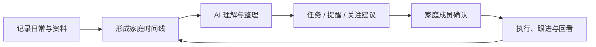
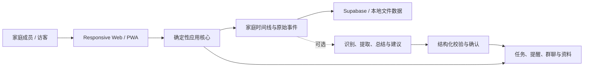

<p align="center">
  
</p>

<h1 align="center">我爱饭米粒</h1>

<p align="center">
  <strong>不是微信，也不是陪聊机器人。它专门操心那些容易被全家忘掉的事。</strong>
</p>

<p align="center">
  平时随手记，时间久了能回看；AI 负责整理、提醒和提出建议，家人负责拍板。<br />
  父母的体检报告、孩子的学校通知、家里的待办和资料，终于不用靠“我记得好像发过”来管理。
</p>

<p align="center">
  
  
  
  
  
</p>

<p align="center">
  <a href="#difference">产品差异</a> ·
  <a href="#health-care">父母健康关注</a> ·
  <a href="#recording">日常记录</a> ·
  <a href="#project-status">当前状态</a> ·
  <a href="#quick-start">快速开始</a> ·
  <a href="#architecture">系统架构</a>
</p>

---

<a id="difference"></a>

## 先说清楚：这不是微信，也不是对话机器人

它有群聊，但不打算取代微信。这里不负责朋友圈、抢红包和凌晨两点的表情包大战；群聊的作用，是让家庭讨论可以沉淀成资料、任务和决定，而不是三天后谁也找不到。

它也有 AI，但不是把聊天框换个颜色就宣布“智能化”。普通对话机器人常常是问一句、答一句、窗口一关，下次再见又像初次见面。饭米粒想做的是家里的长线活：

> **把今天的小事可靠记下来，让明天的家人找得到、看得懂，还知道接下来该关注什么。**

家庭里的重要事情往往跨越很久：父母历年的体检报告、复查日期和用药说明，孩子的成长记录，家务分工，还有那句著名的“我刚才不是在群里说了吗”。饭米粒把它们放进同一条家庭时间线。

| 能力 | 带来的价值 |
| --- | --- |
| 持续记录 | 任务、群聊、文件、语音和家庭事件不再东一块、西一块 |
| 随时间整理 | AI 在保留原始来源的前提下生成日、周、月总结和人物画像草稿，不靠凭空脑补 |
| 资料理解 | 体检报告、检查单和家庭文档可以被解析、检索，回答还能回到原始证据 |
| 协助调度 | 从记录中提出任务、复查、提醒或协作建议；先让家人点头，再真正执行 |
| 随时关注 | 不在父母身边的儿女，也能在授权范围内查看近期变化和待跟进事项 |



AI 不会偷偷绕过家庭成员改重要数据。原始记录是事实，AI 总结只是可以重新生成的解释。它可以提醒“该复查了”，但不能替你妈答应，也不能替医生下诊断。

<a id="health-care"></a>

## 体检报告，不该在家庭群里完成短暂的一生

一份体检报告在群里的常见命运是：上传、已读、收到几个“注意身体”，然后被晚饭照片和天气问候彻底淹没。几个月后想找异常项，只剩全家一起翻聊天记录。

饭米粒希望把这件事做得稍微靠谱一点：

1. **原件别丢**：上传 PDF、图片或文档，原始报告作为可追溯资料保留；
2. **先帮你划重点**：AI 整理检查项目、原文结论和可能需要复查的线索；
3. **儿女随时能问**：获得授权的家人可以查询“妈妈最近一次体检有哪些需要关注的地方”；
4. **别只看完就算**：应用生成复查、问诊或提醒候选，等家人确认后再加入任务；
5. **明年还能接着看**：新的报告、复查结果和备注继续追加，家庭时间线不会每年失忆一次。

```text
父母上传体检报告
        ↓
保留原文件与来源
        ↓
解析检查项目、结论与复查线索
        ↓
儿女按权限查询，回答引用原始资料
        ↓
生成健康跟进任务候选
        ↓
家人确认后提醒和跟进
```

> AI 不穿白大褂。健康资料属于敏感信息，AI 整理不能代替医生诊断，不能把推测写成事实，也不能在未经确认的情况下保存敏感结论或创建健康任务。

### 当然，不只操心体检报告

同一条家庭时间线还可以收留这些“现在不管，以后一定翻箱倒柜”的东西：

- 父母的复查安排、长期用药说明和就医资料；
- 孩子的成长记录、学校通知和活动安排；
- 家庭证件、旅行资料、房屋维护和重要账单；
- 家务分工、采购计划、聚会讨论和待确认决定；
- 家庭成员反复出现的偏好、习惯和需要照顾的事项。

<a id="recording"></a>

## 先把记录工具做好，再谈 AI

家庭成员不需要先背一份提示词教程。一个输入框就能说人话，任务、群聊和资料仍然是清晰、直接的界面。毕竟这是给一家人用的，不是给提示词工程师团建的。

<table>
  <tr>
    <td width="33%" valign="top">
      <h3>✅ 家庭任务</h3>
      记录待办、指定成员、设置时间和提醒。你可以说“周六提醒爸爸复查”，AI 先生成候选，家人确认后才落地。
    </td>
    <td width="33%" valign="top">
      <h3>💬 家庭群聊</h3>
      讨论、语音、附件、表情和临时访客集中在家庭空间里。重点不是替代微信，而是让重要聊天别说完就蒸发。
    </td>
    <td width="33%" valign="top">
      <h3>🗂️ 家庭资料</h3>
      保存图片、视频、文档和语音，支持预览、分类与检索。下次找户口本扫描件，不必先问“到底谁发过”。
    </td>
  </tr>
</table>

不配置模型时，任务、群聊、资料、成员关系和基础提醒照样能用。AI 是加在饭上的菜，不是没有它就不开饭。

## 模型怎么选：丰俭由人，别让 API 账单破坏家庭和谐

应用支持可选模型服务，核心记录功能不绑定某一家：

| 家庭风格 | 建议选择 | 适合什么情况 |
| --- | --- | --- |
| 精打细算型 | **DeepSeek** | 重视性价比，希望先把识别、提取、总结等日常能力跑起来 |
| 预算宽裕型 | **OpenAI API（ChatGPT 路线）** | 更看重模型能力和服务体验，俗称“土豪模式” |
| 先不花钱型 | **暂不接模型** | 先使用任务、群聊、资料和基础提醒，等想明白再配 |

模型不是越贵就越有权力。无论接 DeepSeek 还是 OpenAI API，都只能做识别、提取、总结和建议；权限判断、数据写入和重要操作仍由应用控制。

## 这里以后会有图，现在先让它们占好座位

以下位置预留给使用脱敏演示数据生成的真实界面截图。真实家庭数据不拿来当宣传素材，这个原则比 README 热闹更重要。

<table>
  <tr>
    <td width="50%" align="center"><br /><br /><strong>家庭时间线与快捷记录</strong><br /><sub>产品截图待补充</sub><br /><br /></td>
    <td width="50%" align="center"><br /><br /><strong>家庭任务与成员协作</strong><br /><sub>产品截图待补充</sub><br /><br /></td>
  </tr>
  <tr>
    <td width="50%" align="center"><br /><br /><strong>体检报告解析与证据引用</strong><br /><sub>AI 功能截图待补充</sub><br /><br /></td>
    <td width="50%" align="center"><br /><br /><strong>健康跟进任务确认</strong><br /><sub>AI 功能截图待补充</sub><br /><br /></td>
  </tr>
  <tr>
    <td width="50%" align="center"><br /><br /><strong>家庭日、周、月总结</strong><br /><sub>AI 功能截图待补充</sub><br /><br /></td>
    <td width="50%" align="center"><br /><br /><strong>成员画像与来源证据</strong><br /><sub>AI 功能截图待补充</sub><br /><br /></td>
  </tr>
  <tr>
    <td width="50%" align="center"><br /><br /><strong>长期记忆候选与确认</strong><br /><sub>AI 功能截图待补充</sub><br /><br /></td>
    <td width="50%" align="center"><br /><br /><strong>聊天整理与家庭协商</strong><br /><sub>AI 功能截图待补充</sub><br /><br /></td>
  </tr>
</table>

<a id="project-status"></a>

## 当前状态：能用的说能用，实验的先别吹成魔法

项目处于积极开发阶段。下面写的是当前源码已有的实现边界，不代表每台手机、每个浏览器、每种模型和每种 NAS 都已经被折腾过一遍。

| 能力 | 状态 | 说明 |
| --- | --- | --- |
| 任务、群聊与家庭资料 | ✅ 核心可用 | 可在不配置模型时使用 |
| 图片、文件与语音资料 | ✅ 核心可用 | 支持上传和预览；语音转写需额外服务 |
| PWA 安装与基础缓存 | ✅ 可用 | 安装与缓存范围受浏览器和系统限制 |
| 体检报告等资料解析 | 🧪 实验性 | 支持结构化洞察与来源关联，不提供医疗诊断 |
| 健康跟进任务建议 | 🧪 实验性 | 生成候选后需要用户确认 |
| 日、周、月家庭总结 | 🧪 实验性 | 需要模型与后台整理配置，结果属于派生内容 |
| 成员画像与长期记忆 | 🧪 实验性 | 强调证据、置信度和确认，不静默保存敏感推测 |
| 临时访客与 Web Push | ⚙️ 需配置 | 需要生产 Secret、HTTPS、VAPID 和后台派发 |
| Supabase 数据与认证 | ⚙️ 可选接入 | 本地体验可使用文件模式，生产环境建议配置 Supabase |

## AI 的家规：可以能干，不能擅自当家

| 原则 | 当前做法 |
| --- | --- |
| 原始记录优先 | 用户输入和原始文件保留为事实来源，AI 结果单独存放 |
| 能确定计算就不用模型 | 日期、重复规则、安全检查和权限判断优先使用应用逻辑 |
| 只使用白名单能力 | 模型只能建议已注册的 Action 或预定义 Pipeline |
| 重要操作必须确认 | 创建任务、保存长期记忆、邀请成员和健康总结等需要确认 |
| 每一步可以回看 | 记录输入、解释、执行和展示结果，失败时也不丢失原始事件 |
| 模型可以被替换或关闭 | 不配置模型也能运行核心记录和协作功能 |

```text
用户输入或资料
      ↓
保存原始事件与来源
      ↓
本地规则、安全和权限检查
      ↓
可选 AI 识别、提取、总结或建议
      ↓
结构化校验 → 用户确认 → 确定性执行 → 审计记录
```

<a id="quick-start"></a>

## 快速开始：先在自己电脑上把饭做熟

### Docker Compose（本地体验）

装好 Docker 与 Docker Compose，然后：

```bash
docker compose up --build -d
```

启动后打开 [http://localhost:3000](http://localhost:3000)。运行数据保存在独立 Docker volume 中，不会写入应用镜像。

> 默认 Compose 配置是本机试吃版：启用了本地文件模式并关闭强制登录。直接端到公网，等于把家门钥匙插在锁上，还贴了张“欢迎参观”。

### 本地开发（喜欢自己掌勺）

需要 Node.js 22+ 与 npm 10+：

```bash
cd apps/web
npm ci
cp .env.example .env.local
npm run dev
```

### 质量检查

```bash
npm run typecheck
npm run build
```

完整 smoke、audit、fixture 与设备测试住在独立测试仓，不会混进公开源码。测试数据和家庭数据，最好一辈子别认识。

<a id="architecture"></a>

## 系统架构：AI 坐副驾驶，应用握方向盘



核心数据边界：

```text
raw_events → assistant_interpretations → automation_runs → summaries / profiles / memories
  原始事实           AI 解释                 执行审计              可再生成的派生结果
```

想看严肃版本，可以继续读[能力矩阵](docs/capability-matrix.md)和 [Action Pipeline 数据流](docs/action-pipeline-flow.mmd)。那里少一点段子，多一点合同。

## 部署与配置：一条命令能开张，正式营业还得锁门

一条命令可以启动本地服务；但“能在本机打开”和“适合全家公网使用”是两回事。生产部署还要配置认证、Secret、公开 URL、HTTPS，以及可选的 Supabase、通知和模型服务。

完整环境变量模板见 [`apps/web/.env.example`](apps/web/.env.example)。

| 配置组 | 用途 | 是否必需 |
| --- | --- | --- |
| `FAMILY_APP_ALLOW_FILE_FALLBACK` | 启用服务器本地文件数据模式 | 本地文件模式必需 |
| `NEXT_PUBLIC_APP_URL` | 公开访问地址与邀请链接 | 生产环境必需 |
| `SUPABASE_*` | 数据库、认证、对象存储与服务端写入 | 使用 Supabase 时必需 |
| `*_SECRET` | 会话、邀请、访客与确认签名 | 对应功能在生产环境中必需 |
| `DEEPSEEK_*` | 性价比模型能力 | 可选 |
| `OPENAI_*` | 预算宽裕时的模型与语音能力 | 可选 |
| `VAPID_*` | Web Push 通知 | 使用 Web Push 时必需 |

正式请家人入住前，至少把这些事办了：

1. 设置最终 HTTPS 地址并启用认证；
2. 为所有会话、邀请、访客和确认签名生成全新 Secret；
3. 根据需要配置 Supabase、模型、语音和通知服务；
4. 备份完整的 `data/` 持久化目录或 Docker volume；
5. 在目标设备上验证登录、上传、邀请、通知和 PWA 安装。

## 隐私与安全：家事可以上云，不能上热搜

在自托管模式下，服务、数据库、文件以及模型凭据可以由自己管理。要不要依赖外部服务，由你选择的数据、认证、通知和模型配置决定，不由 README 替你做主。

此公开源码仓不包含真实账户、密钥、聊天记录、家庭资料、上传文件、运行数据库、日志、测试数据、截图、构建缓存或特定云平台配置。

请不要提交 `.env.local`、`apps/web/data/`、数据库备份或用户上传内容，也不要在公开 Issue 中粘贴密钥、真实家庭数据或可直接利用的漏洞细节。家庭群里已经够热闹了，别再请陌生人进数据库。

## 项目结构：厨房在哪，碗柜在哪

```text
.
├── apps/web/
│   ├── src/app/          # 页面、Route Handlers 与 PWA
│   ├── src/components/   # 家庭任务、群聊、资料与设置 UI
│   ├── src/lib/          # 业务核心、AI 路由、动作与服务端逻辑
│   └── public/           # Logo、图标、表情与静态资源
├── supabase/             # Schema、SQL、定时任务与 Edge Functions
├── docs/                 # 能力矩阵与数据流说明
├── docker-compose.yml
└── README.md
```

## 参与贡献：欢迎添菜，别把真实家庭数据端上来

欢迎提交 Issue 和 Pull Request。开饭前请确保：

- TypeScript 类型检查和相关测试通过；
- 不提交真实家庭数据、密钥、截图或运行文件；
- 新功能保持移动端可用，并说明已验证范围；
- 重要写操作保留确认、结构化校验和审计流程；
- README 中的能力状态与实际实现保持一致。

## 许可证：这道菜还没正式开源售卖

当前公开源码仓尚未附带 `LICENSE`，因此暂不授予默认的复制、修改或分发许可。正式公开发布前，请由代码所有者选择合适的许可证并补充 `LICENSE` 文件。

---

<p align="center">
  
  <br />
  <strong>我爱饭米粒</strong>
  <br />
  平时随手记，重要时找得到；AI 帮忙，家人做主
</p>
