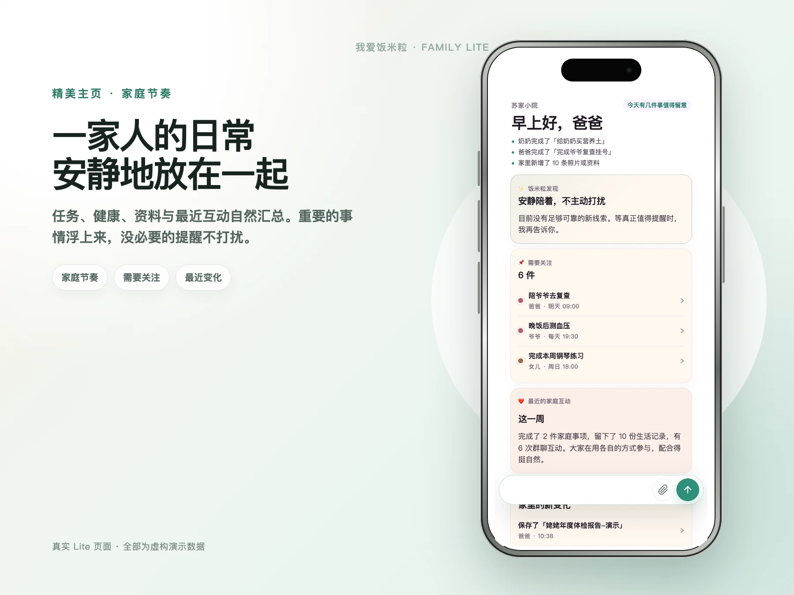
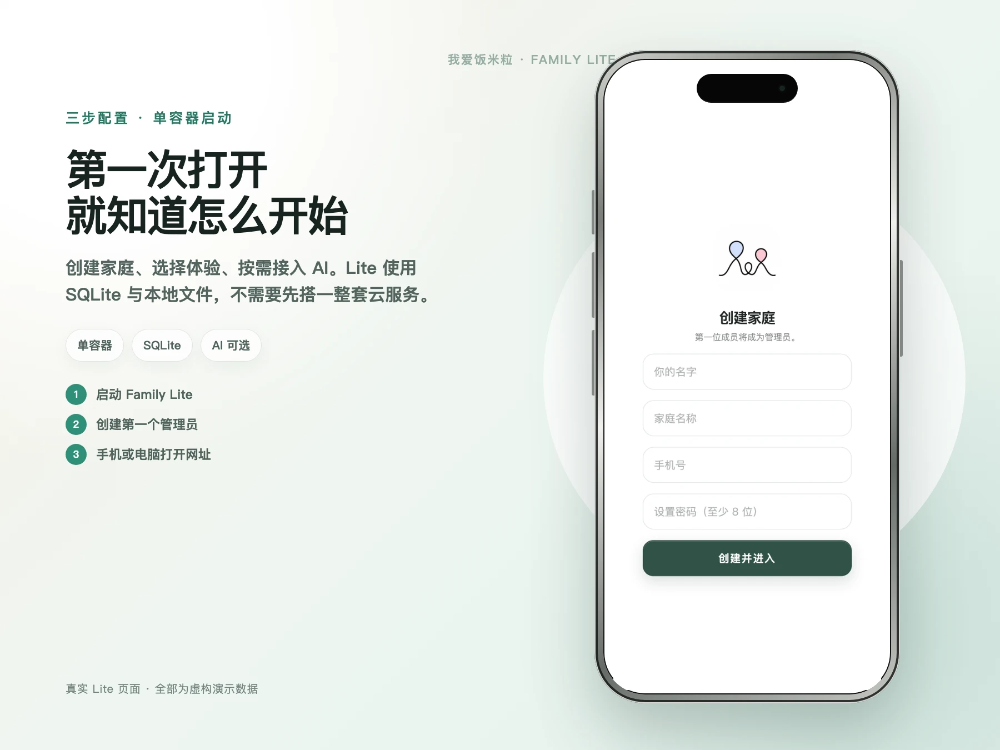
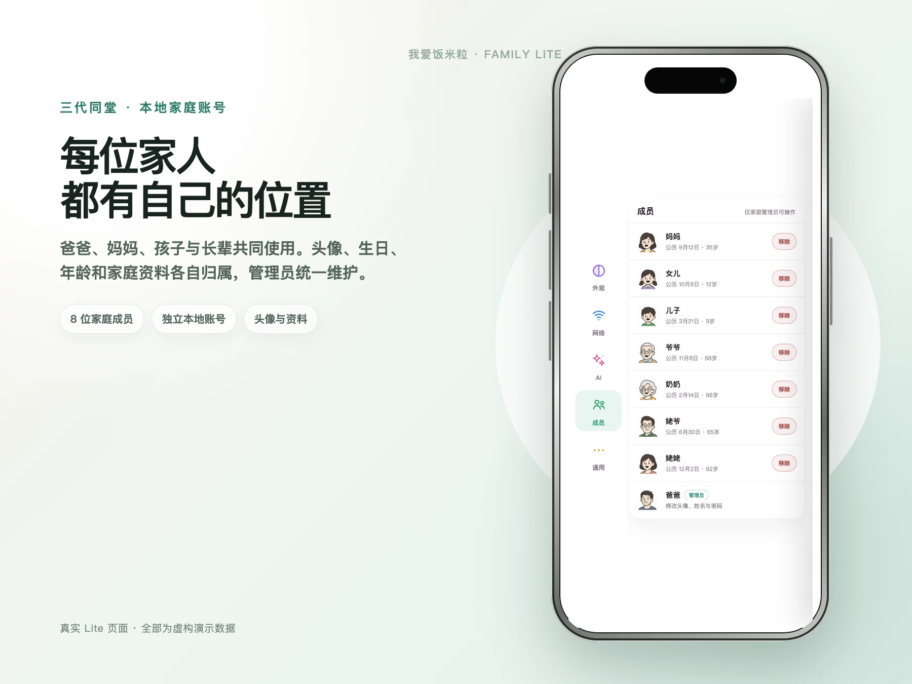
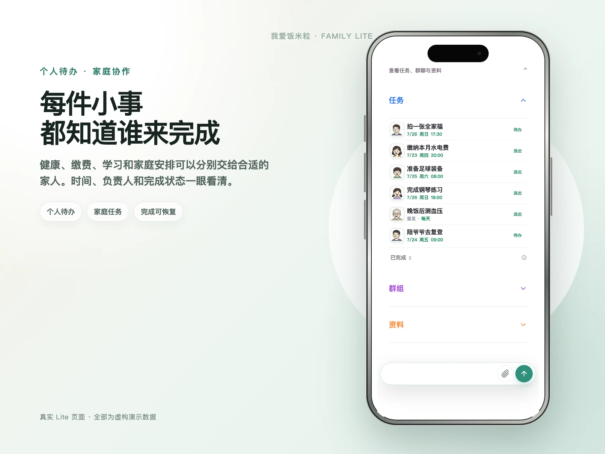
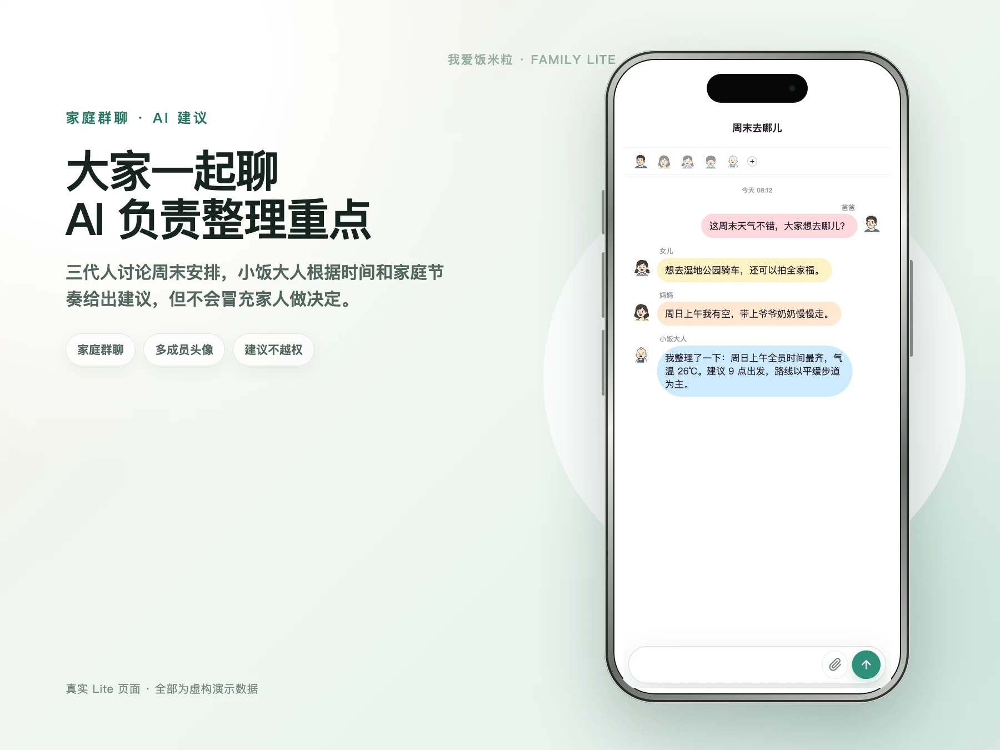
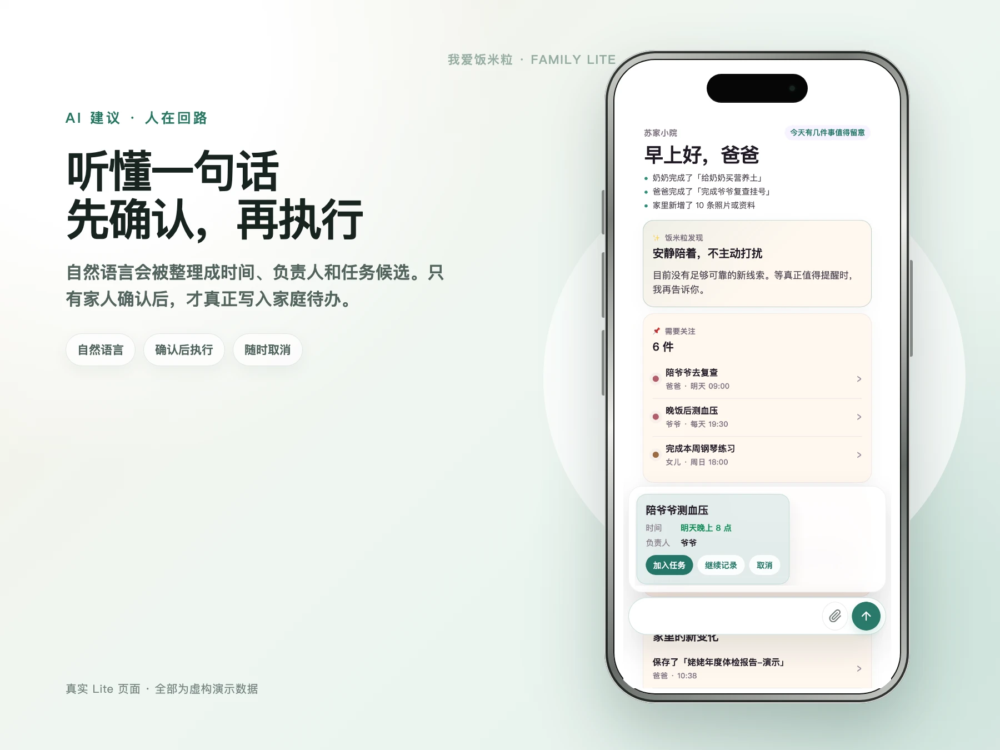
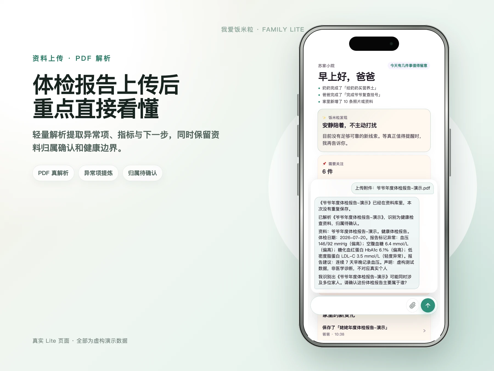
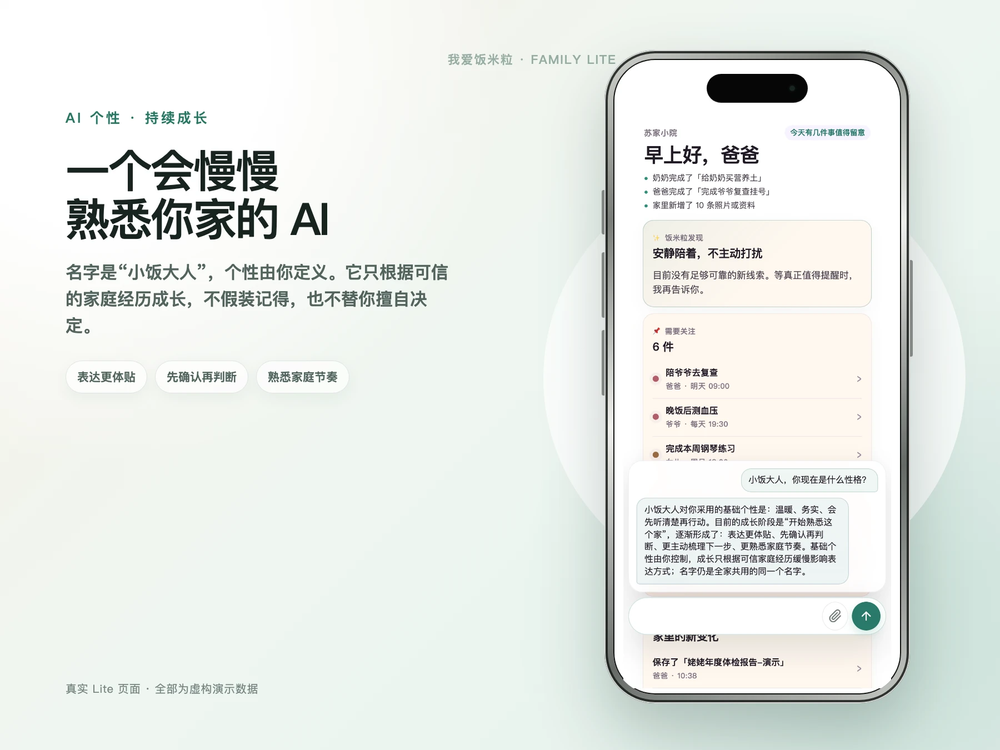
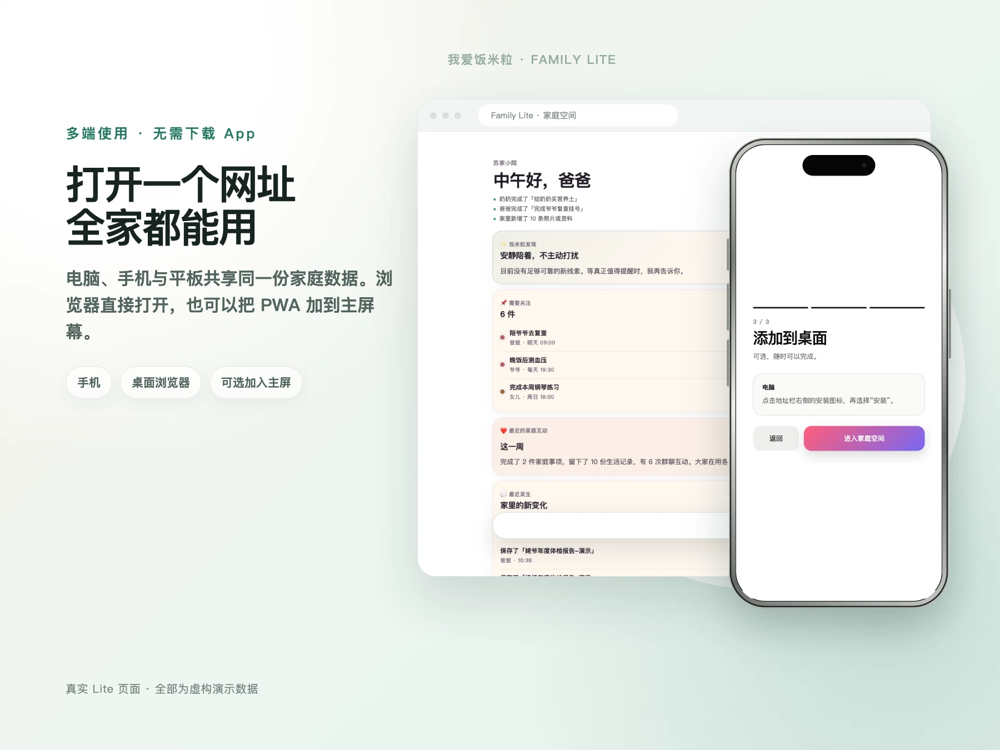

<p align="center">
  
</p>

<h1 align="center">我爱饭米粒 · Family</h1>

<p align="center">
  一个安装在自己设备上的家庭空间。<br />
  把待办、群聊、健康资料与家庭 AI 放在一起，用心记录，安心陪伴。
</p>

<p align="center">
  
  
  
  
  
</p>

<p align="center">
  
</p>

## 为什么做 Family

家庭真正缺少的通常不是另一个聊天群，而是一个能把事情留下来的地方：

- 谁需要复查、谁负责缴费、孩子周末有什么安排，不再埋进聊天记录。
- 体检报告、照片和生活资料按家庭成员归属，几年后仍能找回来。
- AI 可以听懂、整理和建议，但创建任务、保存记忆等重要动作仍由家人确认。
- 数据放在自己的电脑或 NAS；手机、平板和电脑打开同一个网址即可使用。

## 一行启动

安装 Docker 后运行：

```bash
docker run -d --name family --restart unless-stopped -p 3000:3000 -v family-data:/app/data ghcr.io/sujianleo/family:latest
```

打开 `http://设备IP:3000`，创建第一个家庭管理员即可。镜像首次启动会自动准备 SQLite、文件目录和本地安全密钥，不需要 clone 仓库、配置数据库或填写环境变量。

<p align="center">
  
</p>

SQLite 数据库、上传文件和自动生成的安全密钥都保存在 `family-data` 数据卷中。备份这个数据卷，就能一起保存家庭账号、记录与附件。

## 给一家人使用，而不是只给一个人

每位家人都有自己的本地账号、头像与资料。管理员可以邀请和审核新成员，三代人的任务、群聊和资料仍保持清晰归属。

<p align="center">
  
</p>

健康、缴费、学习和家庭安排可以分别交给合适的家人。时间、负责人和完成状态保持清晰，已完成事项也可以恢复。

<p align="center">
  
</p>

自然语言可以创建待办，也可以在家庭群聊里讨论。小饭大人负责整理时间、重点和下一步，不会冒充家人做决定。

<p align="center">
  
</p>

## AI 先建议，家人再确认

说一句“明天晚上 8 点提醒我陪爷爷测血压”，Family 会先整理时间、负责人和任务内容。只有点击确认后，候选才会成为正式待办。

<p align="center">
  
</p>

上传 PDF、图片或票据后，Family 会把资料保存进家庭资料库，并用轻量解析提炼重点。健康资料会保留来源、归属确认和非诊断边界。

<p align="center">
  
</p>

AI 不是没有身份的聊天框。你可以给它命名、设定个性；它只从可信的家庭经历中逐步形成更合适的表达方式。

<p align="center">
  
</p>

## 无需下载，也能像 App 一样使用

Family 是移动优先的 PWA。全家可以直接使用浏览器，也可以选择“添加到主屏幕”。同一份数据可以在手机、平板和桌面浏览器之间使用。

<p align="center">
  
</p>

## 设计原则

- **本地优先：** 不接 AI 也能使用账号、待办、群聊和资料。
- **确认后执行：** AI 输出默认是候选，不是已经发生的事实。
- **家庭边界：** 不同家庭、成员和对话彼此隔离。
- **长期可用：** 数据结构、备份和恢复优先于短期演示效果。
- **移动优先：** 重点适配手机浏览器、PWA 与触摸交互。

## 技术栈

Next.js · TypeScript · SQLite · LangChain / LangGraph · Docker · PWA

AI 提供理解与建议，Family 负责规则、权限、记录与确认。AI Key 只保存在自己的部署环境中。

## License

[MIT](LICENSE)

资源图标来自 [Microsoft Fluent Emoji](https://github.com/microsoft/fluentui-emoji)，按 MIT License 使用。

> Family 仍在成长。欢迎提交 Issue、分享使用场景，或一起把它做成更适合真实家庭的产品。
