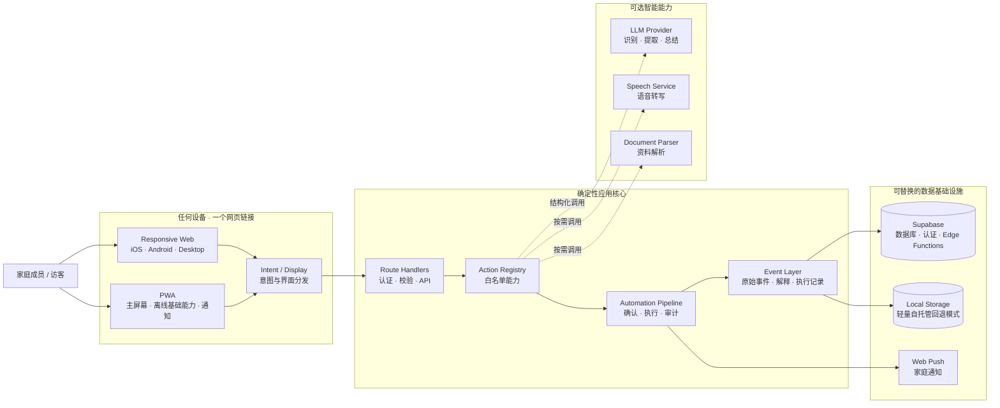

<p align="center">
  
</p>

<h1 align="center">我爱饭米粒</h1>

<p align="center">
  <strong>用心记录 守护家庭</strong>
</p>

<p align="center">
  一个链接，连接每一位家人。<br />
  任务、群聊、资料、提醒与家庭记忆，从此自然地在一起。
</p>

<p align="center">
  
  
  
  
  
</p>

<p align="center">
  <a href="#quick-start">快速开始</a> ·
  <a href="#platforms">全端支持</a> ·
  <a href="#ai-design">AI 设计</a> ·
  <a href="#architecture">系统架构</a> ·
  <a href="#deployment">部署</a>
</p>

---

## 家庭，不该被更多 App 分开

待办在一个应用，照片在另一个应用，重要消息散落在聊天记录里。每个人都在使用工具，却没有一个地方真正属于整个家庭。

我爱饭米粒把家庭生活重新放回一个空间。

打开网页，就能记录一件事、分配一个任务、发起一次讨论、保存一份资料，或者只是看看家里最近发生了什么。没有复杂的工作流，也不需要先学习一套系统。

**它足够简单，可以每天使用；也足够完整，可以长久陪伴一个家庭。**

<a id="platforms"></a>

## 一个链接，全端抵达

无需应用商店。无需区分设备。无需为每个平台维护一套客户端。

分享一个 HTTPS 链接，家人就能通过浏览器进入。需要时，还可以把它安装到主屏幕，获得接近原生 App 的 PWA 体验。

| 设备 | 使用方式 | 体验 |
| --- | --- | --- |
| iPhone / iPad | Safari 或添加到主屏幕 | 响应式界面、PWA、系统通知 |
| Android | Chrome 或安装 PWA | 响应式界面、PWA、系统通知 |
| Mac / Windows / Linux | 任意现代浏览器 | 完整桌面体验，无需安装 |
| 家庭访客 | 临时邀请链接 | 无需成为家庭成员也能参与指定群聊 |

**一个地址，就是全部入口。**

## 极简，不是少做事。是少打扰。

<table>
  <tr>
    <td width="33%" valign="top">
      <h3>✅ 事情，清清楚楚</h3>
      创建、分配和提醒家庭任务。谁来做、什么时候做、是否完成，一眼就能看见。
    </td>
    <td width="33%" valign="top">
      <h3>💬 家人，始终在线</h3>
      家庭群聊、语音、附件、表情和临时访客，都在熟悉而自然的对话里。
    </td>
    <td width="33%" valign="top">
      <h3>🗂️ 资料，不再散落</h3>
      图片、视频和文档统一保存、预览与整理，需要的时候总能找到。
    </td>
  </tr>
  <tr>
    <td width="33%" valign="top">
      <h3>👨‍👩‍👧‍👦 关系，自然呈现</h3>
      每个人看到的家庭关系都符合自己的视角，身份、权限与邀请清晰可控。
    </td>
    <td width="33%" valign="top">
      <h3>🗳️ 决定，一起完成</h3>
      投票、评评理、活动方案和任务协商，让家庭决定不再淹没在聊天里。
    </td>
    <td width="33%" valign="top">
      <h3>🔔 提醒，恰到好处</h3>
      重要的事准时出现，不重要的事保持安静。通知服务于家庭，而不是打扰家庭。
    </td>
  </tr>
</table>

<a id="ai-design"></a>

## AI，会帮忙。也知道什么时候不该动。

很多产品让 AI 决定一切。我们选择了另一条路。

在我爱饭米粒中，AI 负责理解语言、提取信息、整理资料、生成总结和提出建议；真正的权限判断、数据写入和重要操作，始终由确定性的应用逻辑控制。

> **AI 提供理解力，应用保留决定权。**

| 原则 | 我们的做法 |
| --- | --- |
| 能在本地完成，就不依赖模型 | 日期、时间、重复规则与安全检查优先使用确定性逻辑 |
| AI 不能自由行动 | 模型只能选择已经注册的白名单 Action / Pipeline |
| 重要操作必须确认 | 创建任务、保存长期资料、邀请成员等行为交给用户决定 |
| 每一步都能回看 | 原始输入、AI 解释、执行过程和派生结果分层记录 |
| 记忆保持克制 | 成员画像与家庭记忆必须有来源，敏感信息不会静默写入 |
| 模型只是可选能力 | 不配置模型也能运行核心功能，需要时再接入模型或语音服务 |

```text
用户输入
   ↓
本地规则与安全检查
   ↓
白名单能力匹配
   ↓
可选 AI 识别与结构化输出
   ↓
参数校验 → 用户确认 → 确定性执行 → 全链路留痕
```

## 部署，应该像使用一样简单

一台能够运行 Docker 的设备，一条命令，就可以拥有自己的家庭服务。

```bash
docker compose up --build -d
```

不绑定特定云厂商，不要求专有运行环境。你可以把它放在家里的服务器、NAS、VPS 或任意容器平台上。

需要完整数据库和认证能力时，可以连接自己的 Supabase；只想快速体验时，也可以使用内置的本地文件回退模式。

**你的部署方式，由你决定。**

<a id="architecture"></a>

## 🏗️ 系统架构



### 数据边界

```text
raw_events → assistant_interpretations → automation_runs → derived outputs
  原始事实           AI 解释                 执行审计             可再生成结果
```

<a id="quick-start"></a>

## 🚀 快速开始

### 环境要求

- Node.js 22+
- npm 10+
- 可选：Docker / Supabase / 模型 API

### 本地运行

```bash
cd apps/web
npm ci
cp .env.example .env.local
npm run dev
```

打开 [http://localhost:3000](http://localhost:3000)。

### 质量检查

```bash
npm run typecheck
npm run build
```

完整 smoke、audit、fixture 与设备测试保存在独立测试仓，不随公开源码发布。

<a id="deployment"></a>

## 📦 部署

### Docker Compose（推荐）

```bash
docker compose up --build -d
```

运行数据保存在独立 Docker volume 中，不会写入应用镜像。

### Node.js

```bash
cd apps/web
npm ci
npm run build
HOSTNAME=0.0.0.0 PORT=3000 npm run start
```

域名、HTTPS 和反向代理可以使用 Nginx、Caddy 或任意容器平台自行配置。

## ⚙️ 配置

完整模板见 [`apps/web/.env.example`](apps/web/.env.example)。

| 配置组 | 用途 | 是否必需 |
| --- | --- | --- |
| `NEXT_PUBLIC_APP_URL` | 公开访问地址与邀请链接 | 生产环境必需 |
| `SUPABASE_*` | 数据库、认证、对象存储与服务端写入 | 使用 Supabase 时必需 |
| `*_SECRET` | 会话、邀请、访客与确认签名 | 生产环境必需 |
| `OPENAI_*` / `DEEPSEEK_*` | 可选模型与语音能力 | 可选 |
| `VAPID_*` | Web Push 通知 | 可选 |

## 🗺️ 项目结构

```text
.
├── apps/web/
│   ├── src/app/          # 页面、Route Handlers 与 PWA
│   ├── src/components/   # 家庭任务、群聊、资料与设置 UI
│   ├── src/lib/          # 业务核心、AI 路由、动作与服务端逻辑
│   ├── scripts/          # 生产构建、CLI 与维护脚本
│   └── public/           # Logo、图标、表情与静态资源
├── supabase/             # Schema、SQL、定时任务与 Edge Functions
├── docs/                 # 能力矩阵与数据流说明
├── docker-compose.yml
└── README.md
```

## 你的家庭数据，应该属于你的家庭

我爱饭米粒支持完整自托管。服务、数据库、文件和模型凭据都可以掌握在你自己手中。

此公开源码包不包含真实账户、密钥、聊天记录、家庭资料、上传文件、运行数据库、日志、构建缓存、Git 历史或特定云平台配置。

部署前请务必：

1. 为所有 Secret、服务端 Key 和 VAPID 私钥生成新值；
2. 正式环境启用认证、HTTPS 与最小权限策略；
3. 不要提交 `.env.local`、`apps/web/data/` 或任何用户上传内容。

## 📚 文档

- [能力矩阵](docs/capability-matrix.md)
- [Action Pipeline 数据流](docs/action-pipeline-flow.mmd)

---

<p align="center">
  
  <br />
  <strong>我爱饭米粒</strong>
  <br />
  用心记录 守护家庭
</p>

> 正式公开发布前，请由代码所有者选择并补充 `LICENSE`。
