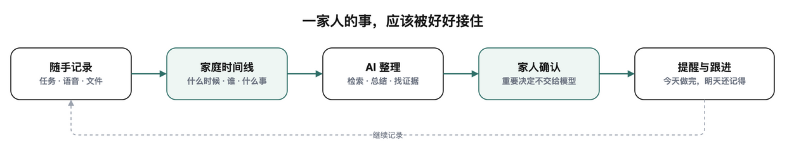

<p align="center">
  
</p>

<h1 align="center">我爱饭米粒</h1>

<p align="center">
  <strong>用心记录 守护家庭</strong><br />
  <sub>家里的事，不应该在聊天记录里失踪。</sub>
</p>

---

<p align="center">
  <strong>不是微信，不是对话机器人，更不是 OS。</strong><br />
  沿时间整理家事、健康资料与家庭协作。
</p>

| 父母健康 | 家庭协作 | 长期记录 |
| :---: | :---: | :---: |
| 收好体检报告与复查安排，经过授权随时关注。 | 提醒、任务和约定有人接住，不再反复翻群聊。 | 今天随手记，明天找得到；决定始终归家人。 |

<p align="center">
  
</p>

<p align="center">
  <strong>DeepSeek</strong> 性价比之选 · <strong>OpenAI</strong> 土豪模式 · 不接模型也能用<br />
  <sub>AI 负责理解、检索和建议；应用负责规则与安全；家人负责决定。</sub>
</p>

### 先跑起来，再慢慢养大它

```bash
docker compose up --build -d
```

打开 [http://localhost:3000](http://localhost:3000)。正式邀请家人前，请先配置认证、Secret、HTTPS 和备份。

<p align="center">
  <a href="docs/user-guide.md"><strong>使用手册</strong></a> ·
  <a href="docs/system-architecture.md"><strong>系统架构</strong></a> ·
  <a href="docs/capability-matrix.md"><strong>能力矩阵</strong></a>
</p>

---

<p align="center">
  <strong>欢迎提建议。</strong>等 UP 主有钱了，就开 Pro Max 给大家 Coding。<br />
  <sub>家庭资料很私人：真实数据、密钥、数据库和运行文件请勿提交。</sub>
</p>
