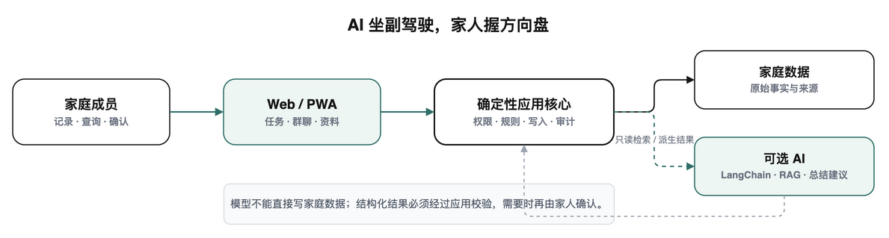

<p align="center">
  
</p>

<h1 align="center">我爱饭米粒</h1>

<p align="center">
  <strong>用心记录 守护家庭</strong><br />
  <sub>家里的事，不应该在聊天记录里失踪。</sub>
</p>

<p align="center">
  
  
  
</p>

<p align="center">
  <a href="#why">为什么做</a> ·
  <a href="#ai">AI 有什么不同</a> ·
  <a href="#start">马上开饭</a> ·
  <a href="docs/user-guide.md">使用手册</a> ·
  <a href="docs/system-architecture.md">架构文档</a>
</p>

---

<a id="why"></a>

## 家里不缺一个新群，缺的是有人把事情记住

<p align="center">
  <strong>不是微信，不是聊天机器人，也不是 OS 级系统。</strong><br />
  它想记住的是：爸爸什么时候复查、孩子最近在忙什么、周末谁买菜，<br />
  以及那句著名的——“我不是早就在群里说过了吗？”
</p>

<p align="center">
  
</p>

<table>
  <tr>
    <td width="33%" valign="top"><strong>🩺 关注父母</strong><br />体检报告保留原件和来源，儿女经授权随时关注；AI 帮忙划重点，但不穿白大褂。</td>
    <td width="33%" valign="top"><strong>🧺 接住家事</strong><br />任务、语音、文件和家庭决定进入同一条时间线，不再召开家庭侦查大会。</td>
    <td width="33%" valign="top"><strong>⏳ 不再失忆</strong><br />真正的智能不是秒回，是半年后还能找到当时发生了什么，以及下一步该做什么。</td>
  </tr>
</table>

<a id="ai"></a>

## 它和普通聊天机器人差在哪

> **聊天机器人：** 你问一句，它答一句。聊得挺好，下次见面谁也不认识谁。
>
> **饭米粒：** 找到时间、人物与原始来源，提出下一步建议；真正写入前，把方向盘交还给家人。

AI 负责理解、检索、总结和建议；应用负责规则与安全；家人负责决定。

模型丰俭由人：**DeepSeek** 是当前性价比主链；**OpenAI API** 目前明确用于语音转写，聊天 Provider 仍在完善；不接模型，任务、群聊和资料也照常使用。

目前核心记录与协作已经可用，健康整理、周期总结、人物画像和长期记忆仍在打磨。宁可写“实验”，也不把“跑过一次”翻译成“重新定义家庭生活”。

<a id="start"></a>

## 先在自己电脑上开饭

```bash
docker compose up --build -d
```

打开 [http://localhost:3000](http://localhost:3000)。正式邀请家人入住前，请按[使用手册](docs/user-guide.md)配置认证、Secret、HTTPS 和备份。

## AI 坐副驾驶，家人握方向盘

<p align="center">
  
</p>

应用核心掌管权限、规则、写入和审计；LangChain 与 RAG 只提供可选的理解能力。模型不能直接改家庭数据。

<p align="center">
  <a href="docs/user-guide.md"><strong>使用手册</strong></a> ·
  <a href="docs/system-architecture.md"><strong>系统架构</strong></a> ·
  <a href="docs/capability-matrix.md"><strong>能力矩阵</strong></a>
</p>

## 欢迎添菜

欢迎提建议和 Pull Request。等 UP 主有钱了，就开 Pro Max 给大家 Coding。

真实家庭数据、密钥、数据库和运行文件不要提交。当前尚未附带 `LICENSE`，正式开放分发前会补充。

---

<p align="center">
  <br />
  <strong>用心记录 守护家庭</strong>
</p>
