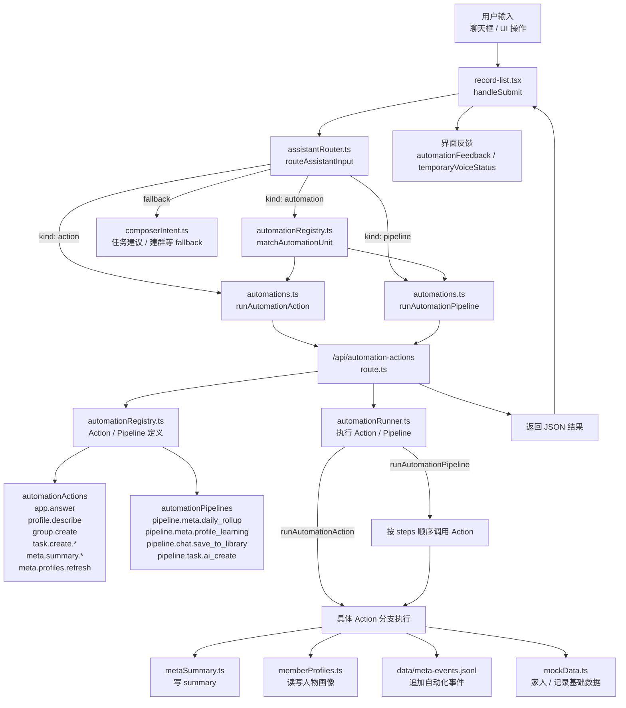

# 项目总文档（Codex 主入口）

这份文档给后续接手这个仓库的人和 Codex 一个统一入口。当前仓库主线按 TypeScript + Next.js + Supabase 理解。

## 1. 项目定位

- 这是一个以家庭为单位传播的 Web App。
- 核心目标是：通过链接进入家庭、选择身份、快速记录日常碎片，再由系统做整理与家庭知识沉淀。
- 当前优先级顺序：
  - Web 操作便利性
  - 秒存与自动保存
  - 关系视图与记录视图的一致性
  - AI 异步整理，不阻塞前端交互

## 2. 仓库怎么理解

### 当前主线结构

- 应用源码：`apps/web/`
- Supabase schema 和种子数据：`supabase/`
- 文档与代理入口：`docs/`、`AGENTS.md`
- 运行时或历史数据：`data/`、`repository/`、`.runtime/`、`.deploy/`

### 当前统一入口

- Next.js 启动：`cd apps/web && npm run dev`
- Next.js 类型检查：`cd apps/web && npm run typecheck`
- Next.js 构建：`cd apps/web && npm run build`
- Supabase schema：`supabase/schema.sql`

说明：

- 当前不再保留 Python/FastAPI/SQLite 作为主线后端。
- 不再使用 `ops/scripts/` 下的旧 Python 启动与 pytest 包装脚本。
- 不再把旧绝对路径写进文档；新增路径优先使用仓库相对路径。

## 3. 快速定位顺序

如果只是想快速找到改动落点，建议按这个顺序：

1. `AGENTS.md`
2. `docs/Architecture.md`
3. `apps/web/src/app/page.tsx`
4. `apps/web/src/components/family-hub-page.tsx`
5. `apps/web/src/lib/`
6. `supabase/schema.sql`

## 4. 先看哪里

### 高频总入口

- 页面入口：`apps/web/src/app/page.tsx`
- 全局样式：`apps/web/src/app/globals.css`
- 根布局：`apps/web/src/app/layout.tsx`
- 主页面组件：`apps/web/src/components/family-hub-page.tsx`
- 顶栏状态：`apps/web/src/components/workspace-topbar.tsx`
- 类型与数据：`apps/web/src/lib/types.ts`、`apps/web/src/lib/mockData.ts`
- Supabase 客户端：`apps/web/src/lib/supabase.ts`
- Supabase schema：`supabase/schema.sql`

### 按用户可见功能找文件

#### 家庭工作区

- 主页面：`apps/web/src/components/family-hub-page.tsx`
- 家庭侧栏：`apps/web/src/components/family-sidebar.tsx`
- 头像组件：`apps/web/src/components/avatar.tsx`

#### 记录列表与详情

- 记录列表：`apps/web/src/components/record-list.tsx`
- 详情面板：`apps/web/src/components/detail-panel.tsx`
- 记录类型和工具：`apps/web/src/lib/records.ts`
- 记录读取 API：`apps/web/src/app/api/family-records/route.ts`

#### 语音记录

- 语音工具：`apps/web/src/lib/voice.ts`
- 语音上传 API：`apps/web/src/app/api/voice-notes/route.ts`

#### AI/分配建议

- 助手面板：`apps/web/src/components/assistant-panel.tsx`
- 分配逻辑：`apps/web/src/lib/assignment.ts`
- 分配建议 API：`apps/web/src/app/api/assignment-suggestions/route.ts`

## 5. 高频联动规则

### Supabase 配置会影响页面状态

- `apps/web/src/lib/supabase.ts` 负责判断 `NEXT_PUBLIC_SUPABASE_URL` 和 `NEXT_PUBLIC_SUPABASE_ANON_KEY` 是否存在。
- `apps/web/src/app/page.tsx` 会把配置状态传给页面。
- 顶栏里的 Supabase 状态来自 `apps/web/src/components/workspace-topbar.tsx`。

### Server route 改动要联动 schema

- 改 `apps/web/src/app/api/*/route.ts` 时，同时确认 `supabase/schema.sql` 里的表、字段、RLS、bucket 是否匹配。
- 服务端写入用 `SUPABASE_SERVICE_ROLE_KEY`，不要把 service role key 暴露给浏览器组件。
- `SUPABASE_SERVICE_ROLE_KEY` 只能在通过 `familyRequestContext.ts` 完成会话与 `family_members.user_id` 归属校验后使用；绝不能把请求体的 `family_id` 或 `actor_member_id` 当作授权依据。
- 生产环境默认要求 `FAMILY_APP_AUTH_REQUIRED=true`，浏览器通过 Supabase Magic Link 获得 Bearer session；每个家庭成员都必须将其 `auth.users.id` 写入对应的 `family_members.user_id`。

### 记录 UI 和类型要一起改

- 记录显示字段改动时，优先一起检查：
  - `apps/web/src/lib/types.ts`
  - `apps/web/src/lib/records.ts`
  - `apps/web/src/components/record-list.tsx`
  - `apps/web/src/components/detail-panel.tsx`

## 6. API 与存储主线

### API route 对照

| Route | 用途 | 主要依赖 |
| --- | --- | --- |
| `apps/web/src/app/api/family-records/route.ts` | 读取家庭记录 | Supabase database |
| `apps/web/src/app/api/voice-notes/route.ts` | 上传语音并创建记录 | Supabase storage + database |
| `apps/web/src/app/api/assignment-suggestions/route.ts` | 生成分配建议 | TypeScript assignment helpers |
| `apps/web/src/app/api/automation-actions/route.ts` | 执行 Action / Pipeline | `automationRegistry.ts` + `automationRunner.ts` |

### 存储原则

- Supabase 是当前数据库、文件存储、鉴权和 realtime 的主线来源。
- 本地 `repository/`、`data/`、`.runtime/`、`.deploy/` 只作为开发、debug、历史兼容或构建运行时目录处理，不作为正式业务数据主线。
- `data/*.jsonl`、`member-profiles.json`、`member-overrides.json` 可以作为本地调试镜像继续存在，但新增“用户输入、AI 解释、自动化执行日志”应优先写入 Supabase。
- 原始文件应走 Supabase Storage，结构化记录走 Supabase 表。
- 生产环境缺少 Supabase 时，`family-records` API 必须失败关闭，不能静默切回 `data/*.jsonl`。本地 JSONL 只允许开发和 smoke 测试使用。

### 确认执行

- `requiresConfirmation=true` 的 Action/Pipeline 必须先返回 `waiting_confirmation` 与短时签名 token。
- 只有浏览器提交原始参数完全匹配的 `confirmation_token` 后，`automationRunner` 才能执行副作用。
- token 使用 `FAMILY_APP_CONFIRMATION_SECRET` 签名；成员改名、创建任务、保存长期资料与邀请成员均不能仅靠前端卡片直接执行。

## 7. 架构现状

当前目标分层：

```text
Supabase data/storage/auth
    |
Next.js server routes
    |
TypeScript domain helpers
    |
React UI components
```

当前代码映射：

- Data/storage/auth：`supabase/schema.sql`、`apps/web/src/lib/supabase.ts`
- Server routes：`apps/web/src/app/api/`
- Domain helpers：`apps/web/src/lib/`
- UI：`apps/web/src/components/`

### Raw Event / Interpretation / Run 架构

AI 与自动化链路的目标数据流是：

```text
raw_events
    |
assistant_interpretations
    |
automation_runs
    |
family_records / room_messages / summaries / member profiles / memories
```

当前第一步落地范围：

- `raw_events`：所有自动化请求和 `/api/meta-events` 的群聊/附件/legacy meta event 先沉淀为原始事件。
- `assistant_interpretations`：前端现有路由结果先以 client snapshot 形式记录候选 action/pipeline、摘要和置信度；后续可替换为 server-side `assistantChain` 的 LLM 解释。
- `automation_runs`：`automationRunner` 在 Action/Pipeline 外层记录输入、输出、状态、错误、side effect 等级和 confirmation 要求。
- AI 助手本身使用 `fanmili` 成员身份；AI 回复会以 `assistant_output` 写入 `raw_events`，让助手自己的能力、偏好、边界和演进也能形成可追溯档案。
- `data/raw-events.jsonl`、`data/assistant-interpretations.jsonl`、`data/automation-runs.jsonl` 是开发调试镜像；正式查询应以 Supabase 表为准。

### Action / Pipeline 架构

`automationRegistry.ts` 管有哪些 Action / Pipeline，`assistantRouter.ts` 管用户输入该走哪个分支，`automationRunner.ts` 管服务端怎么执行。



## 8. 测试与验证

### 最小命令

```bash
cd apps/web
npm run typecheck
npm run build
```

### 何时跑什么

- TypeScript 类型、组件 props、route handler 类型改动：跑 `npm run typecheck`。
- Next.js route、环境变量、构建配置、CSS 或页面结构改动：跑 `npm run build`。
- UI 改动：在 dev server 中做浏览器 sanity check。

## 9. 清理文件原则

- 不要因为“看起来像旧文件”就直接删；先确认是否仍被当前 TypeScript 主线引用。
- Python/FastAPI/pytest/MCP 旧栈不再作为当前主线，除非用户明确要求恢复。
- `webui/` 是旧 Expo/React Native Web 代码，虽然不是当前主线，但它是 TypeScript 代码；清理它应作为单独任务处理。

## 10. 文档约定

- `docs/Architecture.md` 是 `docs/` 下主文档。
- `AGENTS.md` 是编码代理的操作入口。
- 后续如果只是补仓库入口、联动规则、状态、部署入口、可删约束，优先更新这两份。
