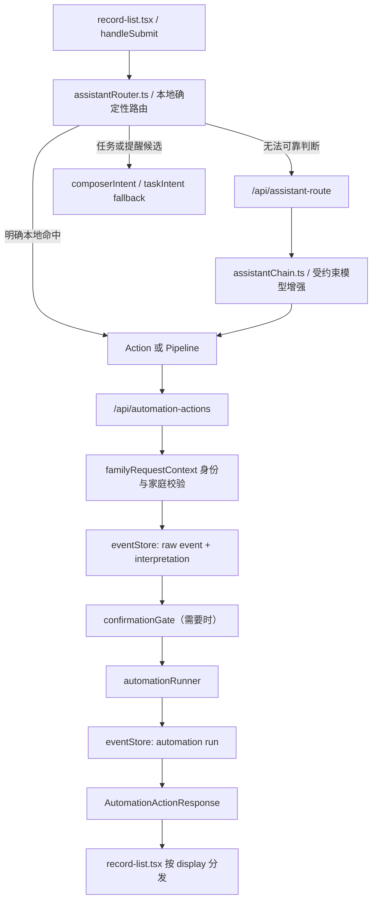

# Family App 当前设计上下文（供其他模型接手）

> 更新时间：2026-07-15
> 当前主线：`project/apps/web/`（Next.js + TypeScript + Supabase）
> 文档目的：让新的模型快速理解产品意图、架构边界、已实现链路、关键细节和不可破坏的约束。

## 0. 先读结论

这个项目不是“自主 Agent”，也不是一个把所有家庭功能塞进聊天框的聊天机器人。

它的定位是：

> **AI-enhanced Family OS（AI 增强的家庭生活 App）**

设计公式是：

```text
Deterministic App Core
  + AI Recognition / Extraction / Summary / Suggestion
```

不是：

```text
Autonomous AI Agent
  + Free Tool Planning
  + Free Database Mutation
  + Unsupervised Multi-step Execution
```

App 决定系统能做什么、什么可以执行、什么必须确认、数据写到哪里、结果显示在哪里。AI 只负责帮助理解、提取、总结和提出候选建议。

任何后续设计都必须保持下面三条主线：

1. **确定性优先**：本地规则和白名单 Action/Pipeline 优先，模型只做补充。
2. **副作用受控**：AI 输出不能直接修改正式数据；中高风险操作必须经过确认。
3. **全链路可追溯**：保留原话、解释、执行和显示结果，AI 生成内容不能冒充原始事实。

---

## 1. 产品想解决什么问题

Family App 是一个以家庭为单位的生活协作空间。用户进入自己的家庭后选择或绑定身份，在一个统一入口里快速表达自然语言，再由 App 将内容放回正确的产品区域。

主要产品区域包括：

- **任务**：个人待办、指派任务、需要同意的任务、填写型任务、选择型任务。
- **群聊**：家庭群组、临时群、受邀请成员和访客参与的讨论。
- **资料**：文件、检查单、地址、家庭知识、长期偏好等可复用信息。
- **记录**：生活碎片、近期事件和可回看的家庭动态。
- **总结**：个人或家庭的日、周、月总结。
- **画像与记忆**：基于可追溯证据形成的成员描述、稳定偏好和关系上下文。
- **家庭决定**：围绕家庭事项发起选择、参与、讨论并沉淀结果。
- **通知**：App 内通知、系统通知和任务到期提醒。

输入框是统一入口，但不是整个产品。用户说一句话后，系统应判断它属于哪个产品能力，并将结构化结果显示到正确位置。

---

## 2. 产品体验原则

### 2.1 App 应该像家庭生活工具，而不是聊天机器人

AI 对话只是辅助界面。长期内容应进入任务、群组、资料、记录、总结等正式区域；临时回答则留在输入框附近。

推荐的交互形态是短回复和结构化卡片，例如：

- task candidate card
- reminder card
- confirmation card
- weather card
- profile card
- resource save card
- group chat summary card
- invite card
- error / clarification card

不要把所有结果都表现成长聊天气泡，也不要让聊天历史占据主页主体。

### 2.2 临时结果与持久数据必须分开

临时结果包括：

- 普通聊天回复
- 天气结果
- 搜索答案
- 人物画像预览
- 澄清问题
- 确认卡片
- 错误提示

这些内容默认显示为 `inline_assistant`，位于底部输入框上方，不应改变任务、群组、资料或记录的数量。

只有真正的持久对象才能进入对应列表：

- 真实任务或任务候选 -> `task_list`
- 可长期保存的资料 -> `resource_list`
- 群消息或群组结果 -> `group_chat`
- 临时 AI 回答 -> `inline_assistant`

未知结果不能默认塞进任务列表。缺少显示信息时，应安全回退到 `inline_assistant`。

### 2.3 当前视觉方向

- 整体界面偏克制、轻量、家庭工具化，不做“AI 控制台”风格。
- 主界面保持现有 App shell，不因单个功能大范围重做布局。
- 语义时间在输入框、AI 候选和任务列表中使用统一的轻量绿色文字提示。
- 时间强调不使用下划线、胶囊、装饰块或过强高亮。
- 设置和通知采用整页抽屉/推入式页面，功能优先，减少多余标题和装饰层级。
- 左右滑动、任务滑动和底部输入框是既有重要交互，局部修改不能破坏这些行为。

### 2.4 移动端输入框是不变量

软件键盘打开后，当前输入框必须稳定贴近可用键盘边缘，并随 `visualViewport` 连续变化。

必须避免：

- 输入框跳动、漂移或闪烁
- 首次聚焦后出现大空隙
- 被键盘遮挡
- 发送后输入框消失或回不到可输入状态
- 主输入框和群聊输入框行为不一致

输入焦点、草稿、附件和发送操作必须落在同一个稳定可见的 composer surface 上。

---

## 3. 总体架构

系统按四层理解：

```text
UI Layer
  -> Intent / Display Layer
  -> Action / Pipeline Layer
  -> Data Layer
```

### 3.1 UI Layer

主要负责：

- 页面、列表、详情、输入框
- 任务、群组、资料、记录、总结的展示
- inline assistant、确认卡、toast、modal、bottom sheet
- 根据结构化 `display` 信息分发结果

UI 不应解析模型自由文本来判断“这是不是任务”或“应该写进哪里”。

### 3.2 Intent / Display Layer

主要负责：

- 用户意图识别
- 候选 Action/Pipeline 选择
- 置信度和澄清判断
- 是否需要确认
- 结果应该显示在哪里、用什么卡片显示

主要文件：

- `apps/web/src/lib/assistantRouter.ts`
- `apps/web/src/lib/taskIntent.ts`
- `apps/web/src/lib/composerIntent.ts`
- `apps/web/src/lib/automations.ts`
- `apps/web/src/lib/server/assistantChain.ts`
- `apps/web/src/app/api/assistant-route/route.ts`

### 3.3 Action / Pipeline Layer

Action 是白名单内的单一确定性能力；Pipeline 是预先定义好的 Action 顺序。

主要文件：

- `apps/web/src/lib/automationRegistry.ts`
- `apps/web/src/lib/automationSchemas.ts`
- `apps/web/src/lib/server/automationRunner.ts`
- `apps/web/src/app/api/automation-actions/route.ts`
- `apps/web/src/lib/server/confirmationGate.ts`

模型可以推荐 Action，但不能绕过注册表直接执行任意工具，也不能在运行时自由编排未知步骤。

### 3.4 Data Layer

Supabase 是正式主线，负责：

- database
- storage
- authentication
- realtime / family-scoped data

主要文件：

- `supabase/schema.sql`
- `apps/web/src/lib/supabase.ts`
- `apps/web/src/lib/server/supabaseServer.ts`
- `apps/web/src/lib/server/familyRequestContext.ts`
- `apps/web/src/lib/server/eventStore.ts`

`data/*.jsonl`、`member-profiles.json`、`member-overrides.json` 目前可以作为开发调试镜像或兼容数据存在，但不能被当作生产正式数据主线。

---

## 4. 用户输入的真实执行链

主页自然语言入口的核心链路是：



需要特别理解：

- `assistantRouter.ts` 是第一层，优先用可测试的本地规则。
- `assistantChain.ts` 是服务器端增强/回退路径，不是默认的自主执行器。
- `/api/assistant-route` 只返回路由结果，不执行副作用。
- `/api/automation-actions` 是正式 Action/Pipeline 入口。
- `automationRunner.ts` 执行已经注册、已经校验、已经满足确认条件的能力。
- `eventStore.ts` 负责把“原话 -> 解释 -> 执行”串成可追溯链路。

---

## 5. 路由设计

### 5.1 路由优先级

推荐并已采用的顺序是：

```text
危险操作检测
  -> 明确的本地规则
  -> registry alias / capability match
  -> 受约束的模型回退
  -> 任务候选、澄清或普通聊天 fallback
```

安全规则不能被模型覆盖。

### 5.2 为什么本地规则优先

以下意图应尽量稳定、可回归测试，而不是完全依赖模型：

- 删除、清空、重置等危险操作
- 邀请成员
- 成员改名
- 成员列表、在线状态、任务/资料/记录查询
- 人物画像查看
- 总结请求
- 记忆保存候选
- 明确的联网搜索表达
- 提醒、时间 + 动作语句
- 助手身份、性格、记忆意识相关问题

这样做的目的不是排斥模型，而是把正确性、安全性和产品一致性放在模型能力之前。

### 5.3 弱模型只能做“选择题”

用于路由的弱/快速模型必须：

- 只从传入的 `candidateActions` 中选择
- 只选择合法的 intent / action / displayTarget / displayType
- 只输出合法 JSON
- 不输出 Markdown 或解释性前后缀
- 不发明 Action id
- 不执行 Action
- 低置信度时返回澄清或安全 fallback

路由合同大致包含：

```ts
type AssistantRouteContract = {
  intent: RouteIntent[];
  candidateActions: AutomationActionId[];
  entities: Record<string, unknown>;
  confidence: number;
  reason: string;
  summary: string;
  requiresConfirmation: boolean;
  displayTarget: AutomationDisplayTarget;
  displayType: AutomationDisplayType;
  actionButtons: AssistantRouteActionButton[];
};
```

### 5.4 快模型和深模型分工

- 快模型：小上下文的分类、候选选择、短回复和轻量提取。
- 深模型：日/周/月总结、家庭记忆候选提取、深层画像草稿。
- 深模型同样不能越过 Action/Pipeline 和确认边界。
- 不应把全部家庭历史无脑塞给模型；应先分层检索和压缩，再附带来源 id。

---

## 6. Action 与 Pipeline

### 6.1 Action 的合同

每个 Action 至少需要表达：

```ts
type ActionContract = {
  id: string;
  description: string;
  inputSchema: unknown;
  outputSchema?: unknown;
  requiresConfirmation: boolean;
  sideEffectLevel: "none" | "low" | "medium" | "high";
};
```

当前代表性 Action 包括：

- `app.chat`
- `app.answer`
- `member.rename`
- `invite.create`
- `safety.dangerous_operation`
- `profile.describe`
- `group.create`
- `decision.create.quick`
- `task.create.approval`
- `task.create.input`
- `task.create.multiple_choice`
- `web.search.duckduckgo`
- `summary.personal.daily`
- `summary.personal.weekly`
- `summary.family.daily`
- `summary.family.weekly`
- `summary.family.monthly`
- `memory.extract.family`
- `memory.save`
- `profile.refresh.deep`
- `meta.summary.*`
- `meta.profiles.refresh`

### 6.2 Pipeline 的边界

允许预定义 Pipeline，例如：

- `pipeline.meta.daily_rollup`
- `pipeline.meta.hourly_learning`
- `pipeline.meta.profile_learning`
- `pipeline.chat.save_to_library`
- `pipeline.task.ai_create`
- `pipeline.summary.daily`
- `pipeline.summary.weekly`
- `pipeline.summary.monthly`
- `pipeline.profile.deep_refresh`

Pipeline 可以按固定顺序调用 Action，但模型不能根据每一步结果临时决定“下一步再调用什么工具”。

### 6.3 结构化响应

当前自动化 API 的前端合同是：

```ts
type AutomationActionResponse = {
  ok: boolean;
  actionId?: string;
  pipelineId?: string;
  display?: AutomationDisplay;
  status?: string;
  userReply?: string;
  data?: unknown;
  error?: string;
};
```

不要继续使用旧的 `result.result` 前端假设。服务端内部执行结果可以嵌套，但 `/api/automation-actions` 返回给 UI 的是上面的扁平结构。

---

## 7. Display 合同

结果显示位置由结构化合同决定：

```ts
type AutomationDisplayTarget =
  | "inline_assistant"
  | "task_list"
  | "resource_list"
  | "group_chat"
  | "modal"
  | "toast"
  | "none";

type AutomationDisplayType =
  | "chat_reply"
  | "weather_card"
  | "task_candidate"
  | "task_item"
  | "resource_item"
  | "profile_card"
  | "summary_card"
  | "web_search_result"
  | "confirmation_card"
  | "error_card";
```

默认映射原则：

| 结果 | target | type |
| --- | --- | --- |
| 普通聊天 | `inline_assistant` | `chat_reply` |
| 天气 | `inline_assistant` | `weather_card` |
| 搜索 | `inline_assistant` | `web_search_result` |
| 人物画像 | `inline_assistant` | `profile_card` |
| 深度总结 | `inline_assistant` | `summary_card` |
| 任务候选 | `task_list` 或确认面板 | `task_candidate` |
| 已创建任务 | `task_list` | `task_item` |
| 长期资料候选 | `inline_assistant` | `confirmation_card` |
| 已保存资料 | `resource_list` | `resource_item` |
| 群组/群消息 | `group_chat` | `chat_reply` |
| 简短成功状态 | `toast` | 对应状态类型 |

`record-list.tsx` 是当前主要分发点。它必须按 `display.target` 处理，不能根据返回文本“猜”要放进哪个列表。

---

## 8. 确认与副作用控制

以下操作原则上需要确认：

- 创建正式任务或提醒
- 保存长期家庭知识
- 修改成员名字
- 邀请成员
- 删除、归档或批量修改数据
- 修改权限
- 代表用户发送群消息
- 生成或暴露敏感家庭/健康总结

服务端确认不是一个纯前端按钮状态，而是签名 token 合同：

1. 第一次请求只返回 `waiting_confirmation`。
2. 返回 `confirmation_card` 和短时 `confirmation_token`。
3. token 绑定 `actionId/pipelineId`、当前成员和原始参数。
4. 浏览器再次提交完全匹配的参数和 token。
5. `confirmationGate.ts` 验证通过后，`automationRunner.ts` 才能执行副作用。

`FAMILY_APP_CONFIRMATION_SECRET` 用于签名。不能通过伪造前端状态绕过服务端确认。

危险操作使用 `safety.dangerous_operation` 隔离。当前设计不是“让模型确认一次就自动删除”，而是先拦截、记录并给出安全说明；真正的高危管理能力需要另行设计更严格的管理员边界。

---

## 9. 事件、解释和执行审计

系统的事实链是：

```text
raw_events
  -> assistant_interpretations
  -> automation_runs
  -> family_records / room_messages / summaries / profiles / memories
```

### 9.1 `raw_events`

保存用户原话、来源、会话、成员、家庭、原始 payload 和客户端/服务端 metadata。

它是源事实。即使后续路由失败或执行失败，也不能丢失原始事件。

### 9.2 `assistant_interpretations`

保存 AI 或本地路由对原始事件的解释，例如：

- intent
- candidate actions
- confidence
- entities
- route source
- matched rule
- prompt/model version
- summary/reason

它是解释，不是事实。

### 9.3 `automation_runs`

保存：

- 执行的 Action/Pipeline
- 输入与输出
- 状态和错误
- 是否需要确认
- side effect level
- 开始和完成时间
- 对应的 raw event / interpretation

它是审计记录，不替代业务数据本身。

### 9.4 派生数据原则

- 原始事实必须保留。
- AI 总结、画像、记忆是派生结果，可以重算。
- 不允许用 AI 摘要覆盖用户原话。
- 所有记忆和画像应尽量保留 source event/message/record/resource/task id。

---

## 10. 记忆、画像和 AI 自身身份

### 10.1 AI 是家庭成员，但不是管理员

助手的稳定内部成员 id 是：

```text
fanmili
```

它的默认显示名是“饭米粒”，但显示名允许像普通成员一样被修改，例如改成“豆包”。

关键规则：

- 内部 id 始终保持 `fanmili`，保证历史连续性。
- 当前显示名从 member overrides 读取，不能硬编码在回复里。
- AI 有身份、性格和记忆意识，可以自然回答“你是谁”“你是什么性格”“你记得什么”。
- AI 是持续存在的家庭成员形象，但没有自由管理家庭数据的权限。

### 10.2 对话证据

`conversationMemory.ts` 会记录：

- `app_chat_turn`
- AI 的 `assistant_output`
- 会话 id
- 用户文本和助手回复

AI 回复以 `fanmili` 身份成为可追溯事件，这样助手自身的能力、偏好、边界和演进也能进入画像证据链。

### 10.3 记忆召回顺序

当用户问“你还记得我最近在研究什么吗”时，优先顺序应为：

1. 当前 session 的最近对话。
2. 当前界面用户可见的近期记录。
3. 更广的历史事件、资料或总结。
4. 没有证据时明确说不确定，不编造。

这样可以避免全局历史和 meta event 污染当前对话。

### 10.4 记忆保存原则

只保存稳定、重复、未来仍有用的信息，例如：

- 长期偏好
- 稳定家庭分工
- 长期习惯
- 多次出现的生活模式
- 用户明确希望系统记住的规则

不自动保存：

- 一次性心情
- 一顿饭
- 临时聊天
- 不确定推测
- 模型自己生成的假设
- 未经确认的敏感信息

`memory.save` 先产生候选，`profile.refresh.deep` 先产生画像草稿；需要用户确认的内容不能直接写入稳定用户状态。

---

## 11. 任务和提醒设计

### 11.1 任务识别不是只看关键词

任务通常由“时间 + 动作”或明确指派/提醒表达构成，例如：

- 明天下午 3 点去买菜
- 20 分钟后提醒我关火
- 周末把阳台整理分给妈妈
- 今晚确认聚餐时间

非任务示例：

- 明天天气怎么样
- 家里有哪些人
- 看看妈妈画像
- 最近有什么新闻
- 普通聊天

不确定时生成候选或澄清，不应直接写任务。

### 11.2 时间语义

`taskIntent.ts` 负责提取并标准化：

- 今天、明天、后天、周末、本周、下周
- 早上、上午、中午、下午、晚上、凌晨
- `10 点`、`10:30`、带空格的中文时间
- 半小时、若干小时/分钟
- 当前工作区正在补充秒级相对时间，例如 `10 秒后`

界面中应显示用户可理解的 `displayTime`，内部同时保留可执行的 `dueAt`。

### 11.3 提醒执行层级

当前提醒能力要区分：

- **App 运行中**：浏览器本地定时可触发系统通知。
- **App 完全关闭**：需要完成 Web Push 公钥、订阅和服务端发送链路后才有可靠后台推送。

不要把“浏览器已允许通知”错误描述成“App 关闭后也一定能收到”。当前工作区正在完善本地任务提醒和设置页状态文案。

---

## 12. 群聊、群组和家庭决定

### 12.1 群组

群组是正式产品区域，不是 AI 临时聊天回复。群组可以由主页自然语言或明确的 UI 操作创建，并应包含：

- 标题
- 创建人/owner
- 家庭成员
- 邀请链接
- 状态与更新时间
- 关联消息或讨论

当前工作区正在让 `group.create` 返回完整的群记录，并按 `group_chat + chat_reply` 分发到群聊区域。

### 12.2 群聊表现

- 连续消息按发送者聚合，减少重复头像和名字。
- 重要讨论可以置顶或沉淀为家庭决定、任务或资料。
- 群聊 composer 与主页 composer 共享移动端稳定性要求。
- 访客入口与正式家庭成员权限必须区分。
- AI 助手默认不应强行出现在普通群聊界面，除非用户明确调用相关能力。

### 12.3 家庭决定

家庭决定不是普通任务的别名。它表达的是“需要家庭成员共同选择或形成结论”的协作过程，包含参与人、选项、投票/立场、讨论、截止时间和最终采纳结果。

AI 可以帮助：

- 从讨论中提炼候选选项
- 总结双方理由
- 生成待确认的决定草稿

AI 不应代替成员做决定或自动投票。

---

## 13. 资料、总结和画像

### 13.1 资料

适合进入资料库的是可长期复用的信息，例如：

- 检查单、报告、文件
- 地址、说明
- 家庭成员长期偏好
- 重要家庭知识
- 从群聊中明确确认保存的内容

临时天气、一次性聊天或一次性情绪不应自动进入资料库。

### 13.2 总结

支持个人/家庭的日、周、月总结。总结生成前应使用 `summarySourceBuilder.ts` 分层获取相关来源，避免把全部数据直接塞给模型。

总结结果应：

- 带有时间范围和 scope
- 保存模型及 prompt version
- 带 source ids
- 明确属于 derived result
- 可重新生成

### 13.3 画像

画像来自事件、对话、任务、资料和总结中的稳定证据，不应由模型凭空描述。

默认画像和本地覆盖合并时，要防止空覆盖把 `fanmili` 或其他成员的有效画像清空。

---

## 14. 身份、授权和数据安全

### 14.1 请求身份不能来自请求体自报

服务端 route 必须通过 `familyRequestContext.ts` 获取并校验当前会话：

- 当前 auth user
- 绑定的 `family_members.user_id`
- 当前 family id
- 当前 member id

不能相信请求体里的 `family_id` 或 `actor_member_id` 来决定授权。

### 14.2 Service Role 边界

`SUPABASE_SERVICE_ROLE_KEY` 只能出现在服务端，并且只能在身份和家庭归属校验之后使用。不能暴露给浏览器，也不能让未经验证的 API 参数驱动跨家庭读写。

### 14.3 生产失败策略

Supabase 是生产主线。生产环境缺少 Supabase 或授权失败时应失败关闭，不能静默退回本地 JSONL 并继续假装写入成功。

---

## 15. 当前技术栈与部署

当前主线：

- Next.js 16
- React 19
- TypeScript 6
- Supabase
- Zod
- LangChain + OpenAI-compatible DeepSeek model endpoint
- DuckDuckGo search tool
- TUS/Uppy 上传

本地常用入口：

```bash
cd project/apps/web
npm run dev
npm run typecheck
npm run build
```

固定公网路径：

```text
https://family-app.example.com/
```

固定部署入口：

```bash
docker compose up --build -d
```

它使用现有固定 HTTPS tunnel，对应本机 `3001` 服务。不要为普通发布改成随机临时 tunnel，也不要干扰无关的本地服务。

---

## 16. 当前代码状态（接手时必须注意）

仓库当前存在未提交工作，不能随意覆盖或回滚。主要演进内容包括：

- 更完整的秒级相对时间解析。
- 浏览器运行期间的本地任务到期提醒。
- 通知设置文案区分“运行时提醒”和“完全关闭后的后台 Web Push”。
- 设置/通知整页抽屉样式和交互调整。
- 主页任务、通知和群组创建的细节完善。
- `group.create` 返回更完整的群记录并进入正确显示区域。
- 相关 smoke tests 和 Repomap 索引同步变化。

这些内容应被视为用户正在进行的工作。新模型在修改前必须先查看 `git status` 和对应 diff，不得使用破坏性命令清除工作区。

---

## 17. 不可破坏的设计约束

后续模型必须遵守：

1. 不引入自主 Agent loop。
2. 不让模型自由选择或连续调用任意工具。
3. 不让 LLM 输出直接修改数据库。
4. 不绕过 Action registry、Zod schema 或 confirmation gate。
5. 不把 AI 解释当作原始事实。
6. 不用摘要覆盖用户原话。
7. 不把临时 AI 回答塞进任务、群组、资料或记录列表。
8. 不把未知输入默认当任务。
9. 不自动保存不稳定或敏感记忆。
10. 不把 `fanmili` 的可改显示名和稳定内部 id 混为一谈。
11. 不相信请求体自报的家庭/成员身份。
12. 不在生产环境静默退回本地 JSONL。
13. 不大范围重写现有 App shell、composer、任务滑动和群组结构。
14. 不用延时、偏移或隐藏症状的补丁代替根因修复。
15. 不覆盖当前未提交的用户工作。

---

## 18. 新模型接手时的建议工作方式

在提出修改前，先回答：

1. 这是哪个产品区域的问题？
2. 当前真实入口和执行链是什么？
3. 应该由本地规则、模型、Action 还是 Pipeline 负责？
4. 是否产生副作用，是否需要确认？
5. 原始事件、解释和执行日志分别写在哪里？
6. 结果的 `display.target` 和 `display.type` 是什么？
7. 会不会误写入其他持久列表？
8. 是否会影响身份、权限、隐私或跨家庭边界？
9. 当前工作区是否已有相关未提交改动？
10. 最小可验证改动是什么？

推荐执行原则：

```text
先审计真实代码链
  -> 明确根因和所有权边界
  -> 设计最小闭环改动
  -> 补结构化合同和回归测试
  -> 类型检查 / 构建 / 对应 smoke
  -> UI 变化再做真实浏览器验证
```

如果用户只要求分析，先输出代码审计和链路映射，不要直接改代码。

---

## 19. 关键文件索引

### 总入口

- `AGENTS.md`
- `docs/Architecture.md`
- `docs/capability-matrix.md`

### 页面和 UI

- `apps/web/src/app/page.tsx`
- `apps/web/src/components/family-hub-page.tsx`
- `apps/web/src/components/record-list.tsx`
- `apps/web/src/components/settings-drawer.tsx`
- `apps/web/src/components/notification-center.tsx`
- `apps/web/src/app/globals.css`

### 路由和自动化

- `apps/web/src/lib/assistantRouter.ts`
- `apps/web/src/lib/taskIntent.ts`
- `apps/web/src/lib/composerIntent.ts`
- `apps/web/src/lib/automationRegistry.ts`
- `apps/web/src/lib/automationSchemas.ts`
- `apps/web/src/lib/automations.ts`
- `apps/web/src/lib/server/assistantChain.ts`
- `apps/web/src/lib/server/automationRunner.ts`
- `apps/web/src/lib/server/confirmationGate.ts`

### API

- `apps/web/src/app/api/assistant-route/route.ts`
- `apps/web/src/app/api/automation-actions/route.ts`
- `apps/web/src/app/api/family-records/route.ts`
- `apps/web/src/app/api/meta-events/route.ts`
- `apps/web/src/app/api/notifications/route.ts`

### 数据、记忆和画像

- `supabase/schema.sql`
- `apps/web/src/lib/server/eventStore.ts`
- `apps/web/src/lib/server/conversationMemory.ts`
- `apps/web/src/lib/server/memberProfiles.ts`
- `apps/web/src/lib/server/memberOverrides.ts`
- `apps/web/src/lib/server/summarySourceBuilder.ts`
- `apps/web/src/lib/server/deepSummary.ts`
- `apps/web/src/lib/server/familyRequestContext.ts`
- `apps/web/src/lib/server/supabaseServer.ts`

---

## 20. 一句话交接

> 请把 Family App 当成一个以家庭任务、群聊、资料、记录、决定、通知和长期记忆为主体的确定性应用；AI 是受约束的识别、提取、总结和建议层，所有副作用必须经过白名单能力、参数校验、必要确认和可追溯事件链，绝不能把项目演变成自主 Agent。
