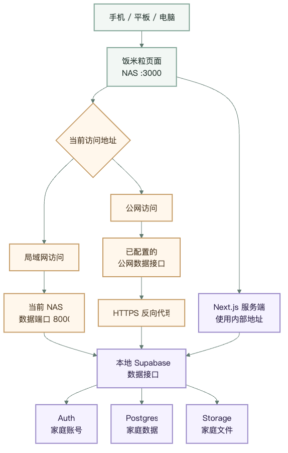
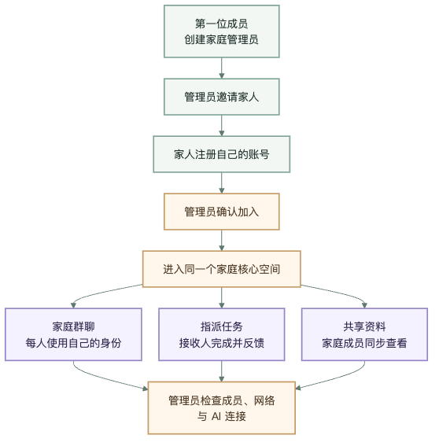

# 本地 Supabase 部署

这套方式适合 NAS 或家中常开的电脑。数据库、账号和文件都留在自己的设备上；手机只需与 NAS 在同一局域网。

## 一键安装

需要 Docker Compose、Git 与 OpenSSL。进入项目目录后运行：

```bash
./scripts/setup-local-supabase.sh
```

脚本会完成：

1. 自动识别 NAS 的局域网 IP；
2. 下载固定版本的 Supabase 官方 Docker 配置；
3. 自动生成数据库密码、JWT、匿名 Key 和服务端 Key；
4. 启动 Auth、Postgres、Storage 等本地服务；
5. 自动创建饭米粒所需的表、权限和存储桶；
6. 构建并启动饭米粒。

运行产生的 Supabase 文件位于 `.runtime/local-supabase`，应用连接配置写入被 Git 忽略的 `.env`。密钥不会提交到仓库。

安装者不需要手工填写 `NEXT_PUBLIC_SUPABASE_URL`、`NEXT_PUBLIC_SUPABASE_ANON_KEY` 或 `SUPABASE_SERVICE_ROLE_KEY`。脚本会为这台部署生成并写入本地配置；浏览器只接收匿名 Key，服务角色 Key 只留在服务端。

## 局域网访问

假设 NAS 地址是 `192.168.1.20`：

- 饭米粒：`http://192.168.1.20:3000`
- Supabase API：`http://192.168.1.20:8000`

手机、平板和电脑连接同一局域网后，可直接打开饭米粒地址。若自动识别了错误网卡：

```bash
FAMILY_APP_HOST=192.168.1.20 ./scripts/setup-local-supabase.sh
```

端口也可以调整：

```bash
FAMILY_APP_PORT=3100 SUPABASE_API_PORT=8100 FAMILY_APP_HOST=192.168.1.20 ./scripts/setup-local-supabase.sh
```

需要在 NAS 防火墙中允许相应端口，但不要把数据库端口直接暴露到公网。

## 首次创建

空数据库第一次打开时会显示“创建家庭”。输入名字、家庭名称、手机号和密码后，系统会一次性创建：

- 管理员登录账号；
- 家庭；
- 管理员成员身份；
- 家庭核心空间及其访问权限。

这个入口只能成功一次。后续成员仍通过邀请和管理员确认加入；确认后会自动进入家庭核心空间。

## 局域网与公网自动切换

从 `localhost`、私有 IP 或 `.local` 地址打开时，浏览器自动使用当前主机的 Supabase 端口；从普通公网域名打开时，使用 `NEXT_PUBLIC_SUPABASE_PUBLIC_URL`。公网地址可以不填，局域网地址由安装时识别的主机地址生成，并可在 **设置 → 网络** 修改。

页面的“自动”模式会分别检测公网与本地地址：只有本地可用时选择本地，两者都可用时选择延迟更低的一条。也可以临时固定为“公网”或“本地”。



图表使用 Mermaid 维护，源文件见 [`local-supabase-mobile.mmd`](local-supabase-mobile.mmd)。PNG 使用纵向窄版布局，便于手机直接阅读。

公网必须为应用与 Supabase API 都配置 HTTPS。运行脚本前可以提供两条公网地址：

```bash
FAMILY_APP_PUBLIC_URL=https://family.example.com \
FAMILY_APP_SUPABASE_PUBLIC_URL=https://data.example.com \
FAMILY_APP_HOST=192.168.1.20 \
./scripts/setup-local-supabase.sh
```

公网反向代理应分别转发到饭米粒端口和 Supabase API 端口。只配置局域网时，应用不会自行把数据发送到托管 Supabase。

## AI（可选）

不配置 AI 时，登录、邀请、群聊、任务、完成反馈和资料仍可使用，页面会提示在设置中接入 API。测试环境或家庭部署可把 `DEEPSEEK_API_KEY` 放在服务端 `.env`；也可以在 **设置 → AI** 选择服务商并测试连接。

DeepSeek 的“测试 API”会执行真实的结构化请求。页面没有填写 Key 时，测试会使用服务端配置；两处都没有 Key 时会返回失败提示。任何服务端 Key 都不要写入 `NEXT_PUBLIC_*` 变量。

## 已验证的家庭协作流程

下面的纵向图适合在手机上阅读。Mermaid 源文件见 [`family-collaboration-mobile.mmd`](family-collaboration-mobile.mmd)。



## 备份

至少备份以下内容：

- `.runtime/local-supabase/docker/volumes/db/data`
- `.runtime/local-supabase/docker/volumes/storage`
- 项目根目录 `.env`

`.env` 含服务端密钥，应加密保存。升级或恢复前，先停止写入并验证备份可以恢复。
