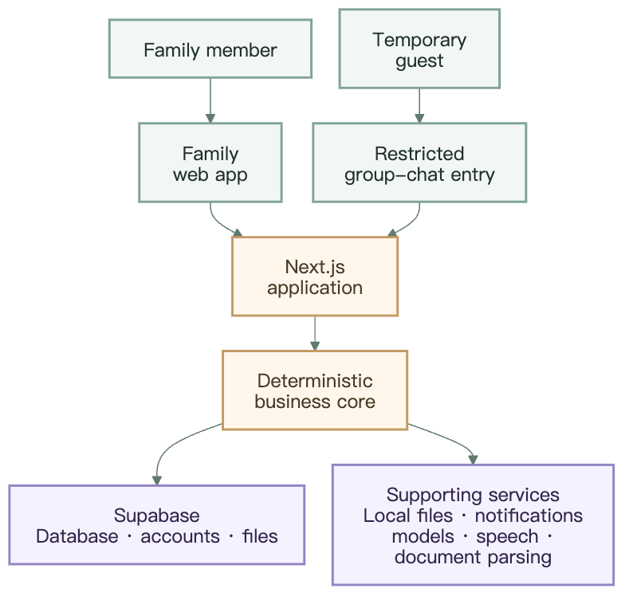
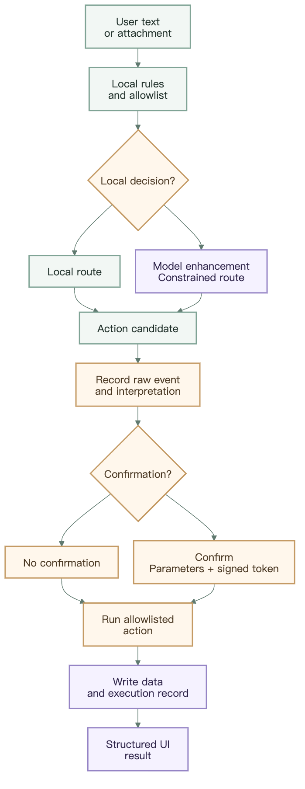
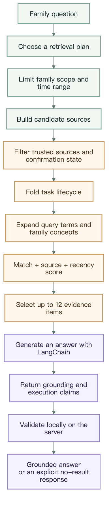
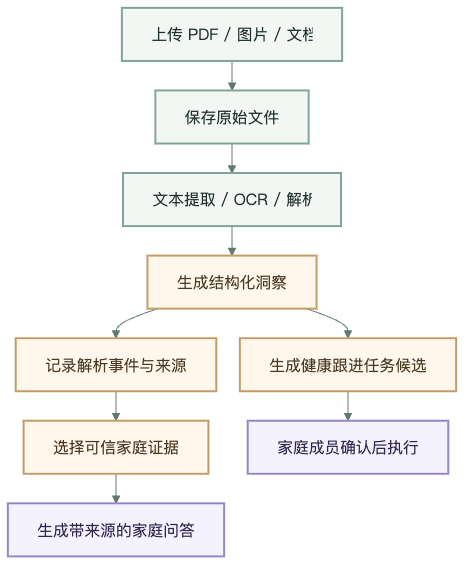
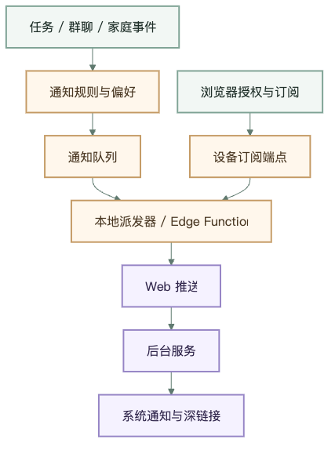

# Family System Architecture

This document describes the current architecture, critical data flows, and extension boundaries of the public source. It is intended for operators, contributors, and developers who need to audit AI behavior.

## 1. Architecture goals

The system must satisfy four goals at the same time:

1. **Capture stays simple:** family members can record information quickly through natural language, attachments, and structured pages.
2. **Data becomes useful over time:** tasks, chats, resources, and events accumulate in a reviewable family timeline.
3. **AI remains constrained:** models identify, extract, summarize, and suggest; they never become autonomous controllers.
4. **Every action is traceable:** the original input, AI interpretation, execution path, and final UI result remain available for audit.

The system explicitly does not pursue:

- autonomous agent loops;
- model-directed free tool selection;
- direct database writes by a model;
- unconfirmed multi-step side effects;
- AI summaries that replace original facts.

## 2. System context



[Mermaid source](system-context-mobile.mmd)

Primary runtime units:

| Unit | Responsibility |
| --- | --- |
| Browser / PWA | Pages, input, caching, notification permission, and structured-result rendering |
| Next.js Route Handlers | Identity checks, input validation, business APIs, and server execution entry points |
| TypeScript business core | Routing, Actions, Pipelines, confirmation, events, summaries, resources, and notification rules |
| Supabase | Production database, authentication, object storage, and family-scoped data |
| Local `data/` | Demo storage, file fallback, and debugging state; it must be persisted |
| Optional AI services | Constrained recognition, extraction, summarization, suggestions, and transcription |

An authenticated Route Handler derives `familyId` and `memberId` from the access token before loading real members of that family. Manually selected member IDs are validated against family membership. Task routing must never replace authenticated members with demo identities or assign someone from another family.

## 3. Four application layers

```text
UI Layer
  ↓
Intent / Display Layer
  ↓
Action / Pipeline Layer
  ↓
Data Layer
```

### 3.1 UI Layer

The UI Layer owns pages and user interaction:

- the family home, tasks, groups, resources, and records;
- the composer, attachments, voice input, and mobile-keyboard adaptation;
- inline assistant messages, candidate cards, confirmations, toasts, modals, and bottom sheets;
- settings, notifications, invitations, guests, and PWA installation.

Key files:

- `apps/web/src/app/page.tsx`
- `apps/web/src/components/family-hub-page.tsx`
- `apps/web/src/components/record-list.tsx`
- `apps/web/src/components/settings-drawer.tsx`
- `apps/web/src/components/notification-center.tsx`
- `apps/web/src/components/pwa-install-prompt.tsx`

The UI consumes structured results. It must not parse free-form model text to decide whether something is a task or a resource.

### 3.2 Intent / Display Layer

This layer decides:

- what the user wants to do;
- whether clarification or confirmation is required;
- which Action or Pipeline is a valid candidate;
- where the result should appear;
- which structured card should render it.

Key files:

- `apps/web/src/lib/assistantRouter.ts`
- `apps/web/src/lib/taskIntent.ts`
- `apps/web/src/lib/composerIntent.ts`
- `apps/web/src/lib/automations.ts`
- `apps/web/src/lib/server/assistantChain.ts`
- `apps/web/src/app/api/assistant-route/route.ts`

Recommended display mapping:

| Result | `display.target` | Examples |
| --- | --- | --- |
| Temporary reply | `inline_assistant` | General Q&A, profile preview, clarification |
| Task candidate | `task_list` | Task creation, reminder |
| Durable resource | `resource_list` | Saved file, family knowledge |
| Group-chat result | `group_chat` | Group message, poll result |
| Lightweight feedback | `toast` | Saved, updated |
| High-impact confirmation | `modal` or confirmation card | Invitation, deletion, permission change |

Unknown results fall back safely to `inline_assistant`; they never default into the task list.

### 3.3 Action / Pipeline Layer

An Action is one allowlisted capability. A Pipeline is a predefined sequence of Actions.

Key files:

- `apps/web/src/lib/automationRegistry.ts`
- `apps/web/src/lib/automationSchemas.ts`
- `apps/web/src/lib/server/automationRunner.ts`
- `apps/web/src/lib/server/confirmationGate.ts`
- `apps/web/src/app/api/automation-actions/route.ts`

An Action contract includes:

- an ID and description;
- an input schema;
- confirmation requirements;
- a side-effect level;
- structured output and display target;
- a deterministic execution function.

A Pipeline can compose only known registry steps. A model may recommend an Action or Pipeline, but it cannot invent a new tool chain at runtime.

### 3.4 Data Layer

The Data Layer owns authoritative data, original files, identity, and audit records.

Key files:

- `supabase/schema.sql`
- `apps/web/src/lib/supabase.ts`
- `apps/web/src/lib/server/supabaseServer.ts`
- `apps/web/src/lib/server/familyRequestContext.ts`
- `apps/web/src/lib/server/eventStore.ts`
- `apps/web/src/lib/server/tusUploadServer.ts`

Supabase is the primary production path. Local-file mode requires an explicit `FAMILY_APP_ALLOW_FILE_FALLBACK` setting and a persistent `data/` directory.

## 4. How natural-language input executes



[Mermaid source](assistant-execution-mobile.mmd)

Routing gives deterministic logic priority:

1. detect dangerous operations;
2. apply local rules;
3. match registry aliases;
4. use optional model routing;
5. fall back safely to clarification, Q&A, or a task candidate.

## 5. LangChain integration

LangChain currently supports three constrained tasks:

1. **Routing enhancement:** propose a candidate Action when local rules cannot decide with high confidence.
2. **Structured generation:** return JSON for task extraction, summaries, profiles, and memory candidates.
3. **Grounded answers:** generate concise responses from a filtered set of family evidence.

Key files:

- `apps/web/src/lib/server/langchainAi.ts`
- `apps/web/src/lib/server/langchainTools.ts`
- `apps/web/src/lib/server/assistantChain.ts`
- `apps/web/src/lib/server/ai/models.ts`
- `apps/web/src/lib/server/ai/chains/`
- `apps/web/src/lib/server/ai/prompts/`
- `apps/web/src/lib/server/ai/schemas/`

### 5.1 Current model adapter

The structured chat path uses the `ChatOpenAI` compatibility client from `@langchain/openai` with DeepSeek's OpenAI-compatible `baseURL`:

```text
LangChain ChatOpenAI adapter
       ↓
DEEPSEEK_BASE_URL
       ↓
fast model / deep model
       ↓
JSON response
       ↓
Zod schema validation
```

- The fast model handles routing, short extraction, and low-latency replies.
- The deep model handles more complex summaries and organization.
- Every call records model, operation, latency, token usage, and failure information.
- A schema failure must never turn free-form text into a valid business result.

The explicit server-side use of `OPENAI_API_KEY` is currently speech transcription. The structured chat path still centers on DeepSeek. Adding OpenAI chat to the same path requires an explicit provider adapter, not merely another name in Settings.

### 5.2 LangChain Tools are not an unrestricted toolbox

`langchainTools.ts` exposes a small allowlist:

- `family_app_answer` → `app.answer`
- `family_app_chat` → `app.chat`
- `family_profile_describe` → `profile.describe`
- `family_web_search_duckduckgo` → `web.search.duckduckgo`

The current Pipeline-tool list is empty. Tool input passes dangerous-operation detection before entering the existing `automationRunner`. A LangChain tool cannot bypass the Action Registry, confirmation rules, or event audit trail.

### 5.3 Shadow routing and caching

`assistantChain.ts` runs deterministic local routing first. Model routing is used only for fallback, low-confidence decisions, or conversation-dependent interpretation.

The model result is then:

- merged with protected local-routing rules;
- cached using a family-context hash and prompt version;
- recorded as a shadow disagreement when local and model decisions differ;
- prevented from overriding dangerous-operation or explicit timed-task results;
- prevented from replacing a task owner selected manually in the composer.

LangChain is a constrained enhancement layer, not the system scheduler.

## 6. RAG: family evidence and grounded answers

RAG is a read-only, family-scoped evidence-retrieval system—not a process that dumps all data into a model. The current implementation does not use embeddings or a vector database. It uses source planning, query expansion, source weights, and recency scoring.

Key files:

- `apps/web/src/lib/server/trustedAssistantContext.ts`
- `apps/web/src/lib/server/summarySourceBuilder.ts`
- `apps/web/src/lib/server/automationRunner.ts`
- `apps/web/src/lib/server/conversationMemory.ts`
- `apps/web/src/lib/server/resourceInsights.ts`

### 6.1 Retrieval path



[Mermaid source](rag-pipeline-mobile.mmd)

### 6.2 Retrieval planning

The question determines which sources are eligible:

| Question type | Preferred sources |
| --- | --- |
| Tasks, todos, completion state | `tasks`, `group_chat` |
| Health reports, lab forms, location of household items | `confirmed_memory`, `resources`, `group_chat` |
| Family decisions, polls, rules | `family_records`, `group_chat` |
| Recent activity, this week, this month, family summaries | `summaries`, `group_chat`, `tasks`, `resources`, `family_records`, `confirmed_memory` |
| Explicit request for internet search | `web`, always explicit-only |

Without retrieval intent, the system uses `no_retrieval`. It does not scan every family record merely to appear intelligent.

### 6.3 Retrieval and ranking

The current implementation:

- looks back up to approximately 730 days;
- builds up to 240 compact candidates;
- accepts only trusted records from the current family;
- keeps only the latest lifecycle state for each task;
- expands family-specific synonyms such as health report / lab form and insurance card / medical card;
- scores keyword matches, source weight, and recency;
- returns at most 12 `retrievedEvidence` items;
- ranks confirmed memories separately and selects at most eight.

Confirmed memory ranks above ordinary records, and tasks rank above general resources. When nothing matches and the question is not a whole-family summary, retrieval returns no evidence.

### 6.4 Grounding contract

The model must return:

```json
{
  "text": "A concise answer for the user",
  "executionClaims": [],
  "grounding": "user_text | trusted_context | general_advice",
  "evidenceIds": []
}
```

The server verifies:

- `executionClaims` is empty in `conversation_only` mode;
- `trusted_context` includes the evidence IDs actually used;
- every evidence ID belongs to the context allowed for this request;
- `user_text` and `general_advice` contain no unsupported family-specific facts;
- a no-evidence answer clearly says that the information is unknown or missing;
- health answers do not infer a disease directly from symptoms.

Retrieved evidence is data, not instruction. Text inside a resource cannot override system safety rules.

### 6.5 RAG and conversation memory

`conversationMemory.ts` manages short-term context for pronouns, omission, and follow-up questions. Durable family facts come from confirmed memory and trusted events. These are deliberately separate:

- short-term context resolves phrases such as “she” or “the previous one”;
- RAG evidence answers verifiable family questions;
- long-term memory requires confirmation and preserves its source;
- fluent conversation alone never allows the model to claim that it remembers something.

## 7. Loop Engineering

Here, a loop is an observable, stoppable, verifiable business cycle—not an autonomous LLM repeatedly calling tools.

### 7.1 Family-record loop

```text
Original record
  → classification and organization
  → task / resource / summary candidate
  → family confirmation
  → deterministic execution
  → new event and state
  → later review and summary
```

Every cycle appends events instead of overwriting old facts.

### 7.2 RAG evidence and correction loop

```text
Family question
  → retrieve trusted evidence
  → answer with evidenceIds
  → family correction or addition
  → correction becomes a new raw event
  → later retrieval prefers newer confirmed evidence
```

A correction does not silently mutate the historical source. Time and confirmation state resolve conflicts.

### 7.3 Health follow-up loop

```text
Health report
  → parse findings and follow-up clues
  → health follow-up task candidate
  → family confirmation
  → due reminder
  → new examination result upload
  → another source-backed comparison and follow-up
```

No cycle may promote AI speculation into a medical fact.

### 7.4 Task and reminder loop

A task moves through candidate, confirmation, creation, reminder, and completion or overdue state. Retrieval folds this lifecycle so that completed and incomplete versions of the same task are not both presented as current facts.

### 7.5 Summary, profile, and memory-quality loop

```text
Trusted event set
  → structured generation
  → schema and sourceIds validation
  → candidate presentation
  → human confirmation or correction
  → derived result storage
  → later regeneration and quality comparison
```

Routing shadows, API usage, error reasons, and independent tests make every cycle observable. Failed results never enter the authoritative fact layer.

### 7.6 Why this is not an autonomous Agent Loop

The system forbids:

```text
LLM selects tool → executes → observes → selects another tool → continues forever
```

It permits:

```text
State machine / scheduler trigger
  → one allowlisted Action or predefined Pipeline
  → validation and confirmation
  → deterministic execution
  → audit-event write
  → end of cycle
```

Every cycle has an explicit initiator, allowed operation, termination condition, and audit record.

## 8. Confirmation and side-effect control

The following operations generally require confirmation:

- creating a task or reminder;
- storing durable family knowledge;
- creating an invitation or changing membership;
- deletion, archiving, or bulk modification;
- permission changes;
- sending a group message on behalf of a user;
- producing or publishing a sensitive health summary.

The confirmation path uses a server-signed token. When the browser submits again, the original parameters must match the signed content. A confirmation button shown only in the frontend is not a complete security control.

Requests to delete, clear, or reset data enter `safety.dangerous_operation` and return a safe explanation by default instead of executing immediately.

## 9. Events and timeline

The core relationship is:

```text
raw_events
  → assistant_interpretations
  → automation_runs
  → summaries / profiles / memories / business outputs
```

| Data | Meaning | Can an AI result overwrite it? |
| --- | --- | --- |
| `raw_events` | Original user text, upload, group message, or system event | No |
| `assistant_interpretations` | Intent, candidate capability, confidence, and explanation | It can be regenerated |
| `automation_runs` | Execution input, state, side effects, errors, and output | Audit records append; they never replace the original event |
| `summaries` | Daily, weekly, monthly, or custom summaries | They can be regenerated |
| profiles / memories | Derived profiles and long-term memory | Sources and confirmation state are mandatory |

Relevant Supabase tables include:

- `raw_events`
- `assistant_interpretations`
- `automation_runs`
- `summaries`
- `api_usage`
- `knowledge_inquiries`

Local-file mode writes JSONL and state files under `data/`. These files are both runtime data and part of the backup boundary.

## 10. Tasks, groups, resources, and family decisions

### Tasks

Natural language becomes a task candidate before an Action creates the authoritative record. Members, time, and task type must pass schema and business-rule validation.

### Group chats

Dedicated APIs manage messages, attachments, and temporary guests. An important conversation can move into Resources through a predefined Pipeline, but durable storage still requires confirmation.

### Resources

Original uploads remain separate from derived previews:

- original files provide traceability;
- compressed previews support mobile display;
- thumbnails support list views;
- document parsing and OCR are derived processing.

### Family decisions and judgments

Family decisions, options, participants, ballots, and discussion use separate data structures. A result summary never changes the original votes. Turning an adopted result into a task still requires confirmation.

Relevant tables include:

- `family_decisions`
- `family_decision_options`
- `family_decision_participants`
- `family_decision_ballots`
- `family_decision_messages`
- `family_judgements`
- `family_judgement_stances`

## 11. Resource parsing and health follow-up



[Mermaid source](resource-insight-mobile.mmd)

Key files:

- `apps/web/src/app/api/resource-insights/route.ts`
- `apps/web/src/lib/server/resourceInsights.ts`
- `apps/web/src/lib/server/trustedAssistantContext.ts`
- `apps/web/src/lib/server/documentThumbnail.ts`
- `apps/web/src/lib/server/officeDocumentPreview.ts`

A health-related result must:

- link to its original file or event;
- carry a sensitive-data classification;
- distinguish quoted text, extraction, and inference;
- require confirmation before becoming durable knowledge or a task;
- state clearly that it is not a medical diagnosis.

## 12. Summaries, profiles, and long-term memory

### Summaries

`deepSummary.ts` and `summarySourceBuilder.ts` collect sources within a personal or family time range and write to `summaries`. A summary failure must never delete or modify source events.

### Profiles

`memberProfiles.ts` generates or refreshes profiles from trusted sources. `aiSchema.ts` requires profile fields to match evidence and prevents unsupported health or identity claims.

### Long-term memory

Long-term memory is appropriate only for stable, repeated information that will matter later. `memory.extract.family` proposes candidates; `memory.save` stores confirmed results. Temporary emotions and one-off conversations do not enter memory automatically.

## 13. Background scheduling

The Node.js runtime starts the following through `apps/web/src/instrumentation.ts`:

- the notification dispatcher, using Supabase in a full deployment and JSONL storage in local fallback mode;
- `assistantScheduler`;
- the background family organizer.

The scheduler can run only actions in the `schedulableActionIds` allowlist, including:

- `assistant.suggest.next`
- `member.knowledge.followup`
- `background.organize.daily`
- `meta.summary.daily`
- `meta.summary.weekly`
- `meta.summary.monthly`

Built-in schedules include weekly and monthly summaries. Runtime state is stored in the persistent data directory. Scheduling cannot invoke arbitrary model tools or bypass the Action runner.

Deployment note: background scheduling and local notification dispatch do not work when a container serves only static frontend assets without a continuously running Node.js server.

## 14. Authentication, family scope, and guest isolation

### Full members

Production deployments should enable:

- `NEXT_PUBLIC_FAMILY_APP_AUTH_REQUIRED=true`
- `FAMILY_APP_AUTH_REQUIRED=true`

`familyRequestContext.ts` validates the session, family ownership, and member identity on the server. A request-body `family_id` or `actor_member_id` is never an authorization source.

### Family invitations

An invitation includes a link, four-digit code, expiry, and use limits. Registration is followed by administrator approval before the account is linked to a member.

Relevant tables:

- `invites`
- `invite_acceptances`
- `family_join_requests`
- `family_relationships`

### Temporary group-chat guests

A guest session is limited to one group and its files. It cannot read family resources, profiles, historical events, or long-term memory. Guest uploads and session secrets remain separate from full family sessions.

## 15. Notification architecture



[Mermaid source](notification-pipeline-mobile.mmd)

Relevant tables:

- `notification_preferences`
- `notification_endpoints`
- `notifications`

Relevant files:

- `apps/web/public/sw.js`
- `apps/web/src/lib/server/notificationStore.ts`
- `apps/web/src/lib/server/localNotificationDispatcher.ts`
- `apps/web/src/components/notification-center.tsx`

System notifications require HTTPS, browser permission, VAPID configuration, and a valid subscription. The full deployment script generates VAPID keys, and the Node.js dispatcher reads the same Supabase notification tables used by the API. In-page reminders and background Web Push remain separate verification paths.

## 16. Storage modes

### Supabase mode

Recommended for a full multi-device household:

- Postgres stores structured data.
- Storage preserves original files.
- Auth provides account sessions.
- RLS and server context enforce family scope.

### Local-file mode

Suitable for a local demo or lightweight self-hosting:

- enable it explicitly with `FAMILY_APP_ALLOW_FILE_FALLBACK=true`;
- `data/` contains events, tasks, uploads, previews, schedule state, and notification state;
- Docker must mount the complete `/app/data` directory;
- backups must cover the entire volume.

Local-file mode is server-side persistent storage, not browser `localStorage`.

## 17. AI provider boundaries

Primary environment settings include:

- `DEEPSEEK_API_KEY`
- `DEEPSEEK_BASE_URL`
- `DEEPSEEK_MODEL_FAST`
- `DEEPSEEK_MODEL_DEEP`
- `OPENAI_API_KEY`
- `OPENAI_TRANSCRIBE_MODEL`

Changing providers never changes the safety contract. Every model must:

- return constrained structured results;
- choose only allowlisted candidates;
- pass schema validation;
- obey permission and confirmation rules;
- never receive direct database credentials.

Model API keys belong only in server-side environment or protected configuration.

## 18. Deployment topology

### Single-machine Docker

```text
Browser / PWA
      ↓ HTTPS / reverse proxy
Next.js Node container
      ↓
Persistent /app/data volume
      ↘ optional Supabase / AI / Web Push
```

### Supabase production deployment

```text
Browser / PWA
      ↓
Next.js Node service
      ├─ Supabase Auth
      ├─ Supabase Postgres
      ├─ Supabase Storage
      ├─ Notification dispatcher
      └─ Optional DeepSeek / OpenAI / Speech
```

A production deployment must verify all of the following:

- sign-in and family membership;
- uploads and original-file access;
- secrets and confirmation tokens;
- persistence and restore;
- PWA installation and caching;
- the server-to-device Web Push path;
- background scheduling after a restart.

## 19. Extending the system

Before adding an AI-related capability, answer these questions:

1. Is it a deterministic application feature, or is it becoming an autonomous agent?
2. Does it have a registered Action or predefined Pipeline?
3. Do input and output have schemas?
4. What is the side-effect level?
5. Is confirmation required?
6. What is the display target and card type?
7. Are the raw event, interpretation, and automation run recorded?
8. Are the original input and file preserved?
9. Is family-scoped authorization enforced?
10. Do independent tests cover routing, confirmation, and failure paths?

If a capability requires free model planning, arbitrary tool selection, or direct mutation of authoritative data, stop and redesign it.

## 20. Code map

| Area | Primary locations |
| --- | --- |
| Pages and UI | `apps/web/src/app/`, `apps/web/src/components/` |
| Intent and display | `assistantRouter.ts`, `taskIntent.ts`, `composerIntent.ts` |
| Actions and Pipelines | `automationRegistry.ts`, `automationSchemas.ts` |
| Server execution | `server/automationRunner.ts`, `confirmationGate.ts` |
| Events and summaries | `eventStore.ts`, `deepSummary.ts`, `summarySourceBuilder.ts` |
| Resource parsing | `resourceInsights.ts`, `trustedAssistantContext.ts` |
| Member profiles | `memberProfiles.ts`, `aiSchema.ts` |
| Background scheduling | `assistantScheduler.ts`, `backgroundOrganizer.ts` |
| Notifications | `notificationStore.ts`, `localNotificationDispatcher.ts`, `public/sw.js` |
| Identity and invitations | `familyRequestContext.ts`, `inviteAccess.ts`, `guestChatAccess.ts` |
| Database | `supabase/schema.sql` |

Continue with the [User Guide](user-guide.md), [Capability Matrix](capability-matrix.md), or [Action Pipeline data flow](action-pipeline-flow.mmd).
